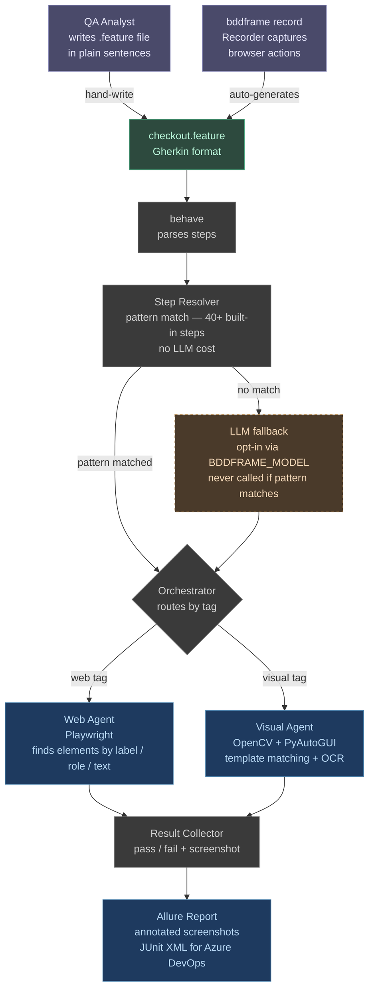

# BDDFrame

**QAs write a `.feature` file in plain sentences. BDDFrame does the rest.**

No selectors. No Page Object classes. No step definitions. No code.

---

## Table of contents

1. [Architecture](#how-it-works)
2. [Installation](#installation)
3. [Setup — first-time config](#setup--first-time-config)
4. [Write a test](#write-a-test)
5. [Run the tests](#run-the-tests)
6. [View the Allure report](#view-the-allure-report)
7. [Run the unit test suite](#run-the-unit-test-suite)
8. [Browser tags reference](#browser-tags-reference)
9. [Built-in step patterns](#built-in-step-patterns)
10. [POM YAML — element aliases](#pom-yaml--element-aliases)
11. [Variable substitution](#variable-substitution)
12. [Optional — LLM step fallback](#optional--llm-step-fallback)
13. [VS Code extension](#vs-code-extension)
14. [CI — Azure DevOps](#ci--azure-devops)
15. [Docs](#docs)

---

## How it works



1. `behave` parses the `.feature` file into steps
2. The step resolver matches each step against 40+ built-in patterns — no LLM call
3. The orchestrator routes each step to the right agent based on scenario tags (`@web`, `@visual`)
4. The web agent locates elements by what they *are* (visible label, ARIA role, text) — no CSS selectors. If the label is **ambiguous** (matches many elements) it consults `pom.yaml` for a scoped selector, then warns (or fails in strict mode) rather than guessing
5. `pom.yaml` is the fallback for elements with no readable label, and can be **page-scoped by URL** so the same name maps to different elements on different pages
6. On failure: screenshot is taken, annotated, and embedded in the Allure report
7. Optional: LLM fallback interprets steps/elements only when you opt in — see the full **[Resolution Hierarchy](docs/resolution-hierarchy.md)** for exactly when the local agent vs an LLM handles each step

> **By default there is no LLM.** With no `BDDFRAME_MODEL` set, BDDFrame is fully local (patterns + Playwright + POM + OpenCV); anything it can't resolve fails loudly. LLM layers only switch on when you set the env vars below.

---

## Installation

**Prerequisites:** Python 3.11+, pip

```bash
# Clone
git clone https://github.com/gheeno/bddframe.git
cd bddframe

# Install — core only (no LLM, no OpenCV)
pip install -e .
playwright install chromium

# OR install everything at once
pip install -e ".[all]"
playwright install chromium
```

**Optional extras** — install only what you need:

| Extra | What it adds | Command |
|-------|-------------|---------|
| `llm` | LLM step fallback + semantic assertions | `pip install -e ".[llm]"` |
| `reporting` | Allure reports + JUnit XML | `pip install -e ".[reporting]"` |
| `visual` | Desktop / visual agent (OpenCV, Tesseract, PyAutoGUI) | `pip install -e ".[visual]"` |
| `lsp` | VS Code language server | `pip install -e ".[lsp]"` |
| `all` | Everything above | `pip install -e ".[all]"` |

**Allure CLI** (for viewing reports):

```bash
brew install allure        # macOS
# or: https://allurereport.org/docs/install/
```

---

## Setup

Three tiers: do the **one-time** setup once per machine, the **per-app** setup
once for each application you test, and pick **per-run** options each time you run.

### 1. One-time setup (once per machine / clone)

Everything under [Installation](#installation) above — clone, `pip install -e .`,
`playwright install chromium`, and (optional) `brew install allure`. Then create
your env file from the template:

```bash
cp .env.example .env
```

Set the global browser defaults in `.env` (these rarely change):

```bash
BDDFRAME_BROWSER=chromium        # chromium | firefox | webkit
BDDFRAME_HEADLESS=false          # true = no visible browser window
BDDFRAME_TIMEOUT=10000           # ms to wait for elements
BDDFRAME_STRICT_LOCATOR=false    # true = ambiguous locators FAIL instead of guessing (recommended in CI)
```

### 2. Per-application setup (once per app under test)

Add that app's credentials/URLs to `.env`. The included example uses
[saucedemo.com](https://www.saucedemo.com) — a public demo site, safe to use:

```bash
SAUCE_USERNAME=standard_user
SAUCE_PASSWORD=secret_sauce
BASE_URL=https://www.saucedemo.com
```

Any `[variable]` in a `.feature` file maps to the matching env var (uppercased,
spaces → underscores): `[sauce username]` → `SAUCE_USERNAME`. Then create a
feature folder for the app (`features/<app>/`) and, if it has unlabelled or
ambiguous elements, a `features/<app>/pom.yaml` — see
[POM YAML](#pom-yaml--element-aliases).

### 3. Per-run setup (each time you run)

Nothing to install — just choose tags (`@smoke`, `@strict`) and CLI flags
(`--headless`, `--browser firefox`, `--tag`). See [Run the tests](#run-the-tests).

### Continuous / CI setup

Set the same env vars as **pipeline variables** (no `.env` needed — see
[CI — Azure DevOps](#ci--azure-devops)). Recommended CI defaults:
`BDDFRAME_HEADLESS=true` and `BDDFRAME_STRICT_LOCATOR=true`.

---

## Write a test

Feature files live in `features/`. Create a subfolder per application or domain.

### Example — test your own website

Create `features/myapp/login.feature`:

```gherkin
Feature: Login

  @web @smoke
  Scenario: Valid user can log in

    Given User is on "https://yourapp.com/login"
    When User enters [MY_EMAIL] in the email field
    And User enters [MY_PASSWORD] in the password field
    And User clicks the login button
    Then User should see "Dashboard"
    And User should have url containing "dashboard"
```

Add to `.env`:

```
MY_EMAIL=you@example.com
MY_PASSWORD=yourpassword
```

That is all. No Python. No selectors. No step definitions.

### Included example — saucedemo checkout

`features/saucedemo/checkout.feature` is a complete end-to-end test that ships with BDDFrame:

```gherkin
@headless
Feature: Sauce Demo Checkout

  @web @smoke
  Scenario: User completes a purchase end to end

    Given User is on "https://www.saucedemo.com"
    When User enters [SAUCE_USERNAME] in the username field
    And User enters [SAUCE_PASSWORD] in the password field
    And User clicks the login button
    Then User should see "Products"

    When User clicks "Add to cart"
    Then User should see "1"

    When User clicks the shopping cart
    Then User should have url containing "cart"

    When User clicks "Checkout"
    And User enters "Jane" in the first name field
    And User enters "Doe" in the last name field
    And User enters "12345" in the zip code field
    And User clicks "Continue"
    And User clicks "Finish"
    Then User should see "Thank you for your order!"
```

Run it:

```bash
bddframe run features/saucedemo/checkout.feature
```

### Record a test instead of writing it

Watch your browser actions and let BDDFrame write the file for you:

```bash
bddframe record --output features/myapp/login.feature --name "Login Flow"
```

A browser opens. Click through the flow. Close the browser. The `.feature` file is written automatically.
Sensitive values (email, card number, password) are replaced with `[VARIABLE]` placeholders.

---

## Run the tests

```bash
# Run all features
bddframe run

# Run a specific file
bddframe run features/saucedemo/login.feature

# Run a specific folder
bddframe run features/saucedemo/

# Run only @smoke scenarios
bddframe run --tag smoke

# Run without a visible browser
bddframe run --headless

# Run with a visible browser (overrides .env)
bddframe run --headed

# Use Firefox or WebKit instead of Chromium
bddframe run --browser firefox
bddframe run --browser webkit

# List all discovered scenarios (no browser launched)
bddframe list

# Validate .feature syntax without running
bddframe validate
```

### What to expect

- Pass/fail printed to terminal per scenario
- Screenshot saved to `screenshots/FAILED_<step>.png` on any failure
- If `pip install -e ".[reporting]"` is installed: Allure JSON written to `allure-results/` automatically

---

## View the Allure report

**Requires:** `pip install -e ".[reporting]"` and `allure` on your PATH (`brew install allure`).

### After a run — open the report

```bash
bddframe report open
```

This runs `allure generate allure-results -o allure-report --clean` then `allure open allure-report` and opens a browser tab.

### Manual steps (same result)

```bash
allure generate allure-results -o allure-report --clean
allure open allure-report
```

### What you see in the report

| Section | Content |
|---------|---------|
| Overview | Pass / fail / skip counts, duration, trend chart |
| Suites | Each `.feature` file → each scenario → each step |
| Behaviours | Grouped by Feature name |
| Timeline | When each scenario ran |
| Failed step | Error message + annotated screenshot |
| Step list | Every step highlighted green (pass) or red (fail) |

### Regenerate from existing results

```bash
bddframe report generate
```

---

## Run the unit test suite

BDDFrame's own test suite runs with **no browser, no LLM, and no display** required.

```bash
# Run all tests
python -m pytest tests/ -v

# OR via Make
make test

# Run a specific test file
python -m pytest tests/test_cli_hardening.py -v
python -m pytest tests/test_hooks_hardening.py -v
python -m pytest tests/test_lsp.py -v
python -m pytest tests/test_reporting.py -v
python -m pytest tests/test_recorder.py -v
python -m pytest tests/test_visual_patterns.py -v
python -m pytest tests/test_visual_matcher.py -v
```

**Expected result:** 125 passed, 0 failed.

| Test file | What it covers | Tests |
|-----------|---------------|-------|
| `test_cli_hardening.py` | CLI flags, env var normalisation, browser validation, path resolution | 20 |
| `test_hooks_hardening.py` | Tag conflict warnings, browser validation, cleanup leak prevention | 10 |
| `test_lsp.py` | LSP step validation, KNOWN_TAGS, .env variable completions | 17 |
| `test_reporting.py` | Allure JSON writer, JUnit XML, screenshot annotation | 20 |
| `test_recorder.py` | Recorder navigation/fill/click events, sensitive value redaction | 20 |
| `test_visual_patterns.py` | Visual step pattern matching (18 patterns) | 22 |
| `test_visual_matcher.py` | OpenCV template matching (mocked — no screen access) | 5 |
| `test_pom_page_scope.py` | Page-scoped POM lookup, `shared:`, flat legacy, page pin | 5 |
| `test_locator_ambiguity.py` | Ambiguity detection, strict vs lenient escalation | 4 |
| `test_patterns_setpage.py` | Page-pin step pattern, navigate not shadowed | 2 |

---

## Browser tags reference

Add tags to a `Scenario` or `Feature` to control the browser. Feature-level tags apply to every scenario in that file.

| Tag | Effect |
|-----|--------|
| `@web` | Chromium (default) |
| `@headless` | No visible browser window |
| `@headed` | Force browser visible — overrides `--headless` and `.env` |
| `@firefox` | Use Firefox |
| `@webkit` | Use Safari engine (WebKit) |
| `@mobile @iphone` | iPhone 13 emulation |
| `@mobile @android` | Pixel 5 emulation |
| `@slow` | 500 ms delay between actions — useful for debugging |
| `@record_video` | Record `.webm` video to `videos/` |
| `@strict` | Ambiguous locators (a label matching many elements) **fail** instead of using the first match |
| `@visual` | Route to the desktop/OpenCV agent instead of the web agent |

**Priority (highest wins):** `@headed` > `@headless` > `--headed` > `--headless` > `.env`

```gherkin
@headless
Feature: Regression Suite        ← all scenarios run headless

  @web @smoke
  Scenario: Standard login        ← headless (inherited from Feature)

  @web @headed
  Scenario: Debug this one        ← headed, overrides the Feature tag
```

---

## Built-in step patterns

Subject (`User`, `I`, `The user`, `As a user`) is stripped automatically, so all variants work.

### Navigation
```gherkin
Given User is on "https://example.com"
When User navigates to "https://example.com/cart"
When User goes to "https://example.com/checkout"
When User opens "https://example.com"
```

### Forms
```gherkin
When User enters "value" in the email field
When User enters [MY_EMAIL] in the email field
When User fills in the username with "admin"
When User types "hello" into the search box
When User clears the search field
```

### Clicks
```gherkin
When User clicks the login button
When User clicks "Submit"
When User clicks the "Proceed to Checkout" link
When User presses the confirm button
When User taps "Menu"
```

### Dropdowns and checkboxes
```gherkin
When User selects "Medium" from the size dropdown
When User checks the "Remember me" checkbox
When User unchecks the newsletter checkbox
```

### Waiting
```gherkin
And User waits for the page to load
And User waits for the page to fully load
And User waits until "Order confirmed" appears
And User waits until "Spinner" disappears
And User waits 2 seconds
```

### Scrolling
```gherkin
When User scrolls down
When User scrolls up
When User scrolls to "Footer"
```

### Assertions
```gherkin
Then User should see "Products"
Then User should not see "Error"
Then User should have url containing "dashboard"
And the page title should contain "Swag Labs"
```

### Screenshots
```gherkin
And User takes a screenshot "after-login"
```

### Semantic / visual (requires `BDDFRAME_MODEL` in `.env`)
```gherkin
Then the checkout form should show a success state
And the screen should look the same as before
And the "header" screen should look the same as before ignoring the navigation
```

---

## POM YAML — element aliases

If an element has no readable text (icon buttons, legacy apps), define an alias in a `pom.yaml` file.

**Local POM** — `features/myapp/pom.yaml` (applies only to that folder):

```yaml
burger menu:
  id: react-burger-menu-btn

shopping cart:
  css: ".shopping_cart_link"

search box:
  testid: search-input
```

**Global POM** — `features/pom.yaml` (applies to all feature files):

```yaml
cookie accept button:
  id: onetrust-accept-btn-handler

navigation menu:
  role: navigation
```

Then use the alias name naturally in steps:

```gherkin
When User clicks the burger menu
When User clicks the shopping cart
```

Supported selector types: `css`, `xpath`, `id`, `testid`, `text`, `role`

### Page-scoped POM — same name, different element per page

When a name like `search` means a different element on different pages, scope it
by URL. The framework reads the live URL and picks the matching block:

```yaml
pages:
  home:
    match: { url_contains: "example.com/$" }   # regex on page.url
    search: { css: "input.home-search" }
  results:
    match: { url_contains: "/search" }
    search: { css: "input.results-filter" }
shared:                                         # checked after the active page
  cookie accept: { id: onetrust-accept-btn-handler }
```

For single-page apps where the URL never changes, pin the page explicitly:

```gherkin
Given User is on the "results" page
```

### Ambiguous elements

If a label matches **multiple** elements (e.g. six "Add to cart" buttons), the
framework uses a POM entry for that key if one exists; otherwise it warns and
uses the first match (or fails, under `@strict` / `BDDFRAME_STRICT_LOCATOR`).
Full details: **[POM Key Mapping](docs/pom-key-mapping.md)** and
**[Resolution Hierarchy](docs/resolution-hierarchy.md)**.

---

## Variable substitution

Any `[variable name]` in a step maps to an environment variable. Lookup rules:
- Uppercased: `[my email]` → `MY_EMAIL`
- Spaces become underscores: `[sauce username]` → `SAUCE_USERNAME`
- Case-insensitive in the feature file

```gherkin
When User enters [MY_EMAIL] in the email field        ← reads MY_EMAIL from .env
When User enters [my email] in the email field        ← same thing
```

Variables are loaded from `.env` first, then from the shell environment (CI pipeline variables work without any changes).

---

## Optional — LLM step fallback

If a step doesn't match any built-in pattern, BDDFrame can ask an LLM to interpret it.
The LLM is **only called when no pattern matches** — most steps never hit it.

```bash
# .env — choose one:

# Local Ollama (free, runs on your machine)
BDDFRAME_MODEL=ollama/llama3
BDDFRAME_LLM_URL=http://localhost:11434

# Hosted OpenAI
BDDFRAME_MODEL=openai/gpt-4o-mini
BDDFRAME_LLM_URL=https://api.openai.com/v1
OPENAI_API_KEY=sk-...
```

Then install the LLM extra:

```bash
pip install -e ".[llm]"
```

**Which env var gates which LLM layer** (see [Resolution Hierarchy](docs/resolution-hierarchy.md)):

| Var | Turns on | Must be |
|-----|----------|---------|
| `BDDFRAME_MODEL` | LLM step fallback · web vision element-locate · semantic & visual-baseline assertions | vision-capable for the assertion/locate features (e.g. `openai/gpt-4o`, `ollama/llava`) |
| `BDDFRAME_VISION_MODEL` | The `@visual` desktop agent's image vision-locate fallback | vision-capable |

```bash
# Web semantic assertions + vision element-locate (uses BDDFRAME_MODEL):
BDDFRAME_MODEL=openai/gpt-4o
# Desktop / @visual image fallback:
BDDFRAME_VISION_MODEL=ollama/llava
```

---

## VS Code extension

Syntax highlighting, `[variable]` colouring, step validation squiggles, and `@tag` autocomplete.

```bash
pip install -e ".[lsp]"
cd vscode-extension && npm install && cd ..

# Symlink into VS Code extensions
ln -s $(pwd)/vscode-extension ~/.vscode/extensions/bddframe-0.1.0
```

Fully quit VS Code (`Cmd+Q` — not just close the window), then reopen.

**Disable the Cucumber extension for this workspace** — both activate on `.feature` files and conflict:

1. `Cmd+Shift+X` → search "Cucumber"
2. Right-click `alexkrechik.cucumberautocomplete` → **Disable (Workspace)**
3. `Cmd+Shift+P` → **Developer: Reload Window**

**Suppress unknown step warnings** (for steps handled by the LLM at runtime):

```json
// .vscode/settings.json
{
  "bddframe.unknownStepSeverity": "none"
}
```

Options: `"warning"` (default) · `"information"` · `"none"`

---

## CI — Azure DevOps

Drop-in pipeline files are in the project root:

**Linux** — `azure-pipelines.yml`
**Windows** — `azure-pipelines-windows.yml`

Create a variable group called `bddframe-secrets` in Azure DevOps with your credentials (`BASE_URL`, `MY_EMAIL`, etc.), link the pipeline YAML, done.

Tests run headless. Failures upload annotated screenshots as pipeline artifacts. Pass/fail counts appear in Azure Test Plans via the JUnit XML at `allure-results/junit.xml`.

---

## Docs

**Start here**
- [Getting Started](docs/getting-started.md) ← full walkthrough
- [Writing a Test](docs/writing-a-test.md) ← step-by-step: happy path + problematic locators
- [Resolution Hierarchy](docs/resolution-hierarchy.md) ← when the local agent vs an LLM handles a step
- [POM Key Mapping](docs/pom-key-mapping.md) ← how step wording maps to `pom.yaml` keys

**Design phases**
- [Phase 1 — Foundation](docs/phase-01-foundation.md)
- [Phase 2 — Web Agent](docs/phase-02-web-agent.md)
- [Phase 3 — CLI & Hooks Hardening](docs/phase-03-hardening.md)
- [Phase 4 — Visual / Desktop Agent](docs/phase-04-visual-agent.md)
- [Phase 5 — Reporting](docs/phase-05-reporting.md)
- [Phase 6 — CLI, Recorder & Azure DevOps](docs/phase-06-cli-devops.md)
- [Phase 7 — Syntax Highlighting](docs/phase-07-syntax-highlighting.md)
- [Phase 8 — Test Development Guide](docs/phase-08-test-development.md)
- [Phase 9 — Element Disambiguation](docs/phase-09-element-disambiguation.md)
