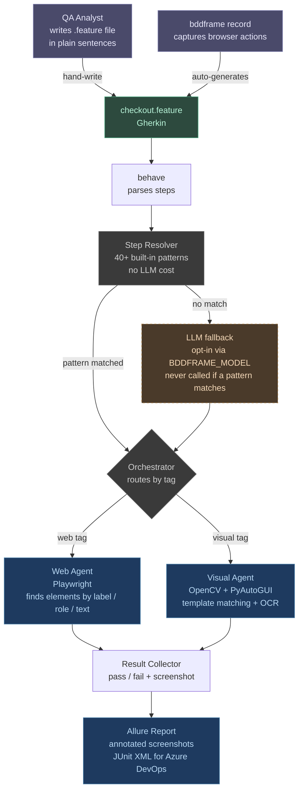

# BDDFrame

**QAs write a `.feature` file in plain sentences. BDDFrame does the rest.**

No selectors. No Page Object classes. No step definitions. No code.

```gherkin
@web @smoke
Scenario: Valid user can log in
  Given User is on "https://www.saucedemo.com"
  When User enters [SAUCE_USERNAME] in the username field
  And User enters [SAUCE_PASSWORD] in the password field
  And User clicks the login button
  Then User should see "Products"
```

That's the whole test — no Python, no `By.id`, no glue.

---

## Contents

1. [How it works](#how-it-works)
2. [Install](#install)
3. [Configure](#configure)
4. [Write & run a test](#write--run-a-test)
5. [Reports — what to expect](#reports--what-to-expect)
6. [The LLM — when it triggers](#the-llm--when-it-triggers)
7. [Docs](#docs)

---

## How it works



1. `behave` parses the `.feature` file into steps.
2. The resolver matches each step against 40+ built-in patterns — **no LLM call**.
3. The orchestrator routes by scenario tag (`@web`, `@visual`).
4. The web agent finds elements by what they *are* (visible label, ARIA role, text) — no CSS selectors. Ambiguous? It consults `pom.yaml`, then warns (or fails under strict mode) rather than guessing.
5. On failure: an annotated screenshot is embedded in the Allure report.

> **There is no LLM by default.** With no `BDDFRAME_MODEL` set, BDDFrame is fully
> local (patterns + Playwright + POM + OpenCV) and anything it can't resolve fails
> loudly. LLM layers switch on only when you opt in — see [The LLM](#the-llm--when-it-triggers).

Full deep dive (study it like Selenium/Appium/Selenide): **[docs/architecture.md](docs/architecture.md)**.

---

## Install

**Prerequisites:** Python 3.11+, [uv](https://docs.astral.sh/uv/) (the repo ships
`uv.lock`; plain `pip` works too).

```bash
git clone https://github.com/gheeno/bddframe.git
cd bddframe

uv pip install -e ".[all]"      # or: pip install -e ".[all]"
playwright install chromium
```

Core only? `uv pip install -e .`. Or pick extras: `llm`, `reporting`, `visual`,
`lsp`. For Allure reports also install the CLI: `brew install allure`
([other platforms](https://allurereport.org/docs/install/)).

---

## Configure

```bash
cp .env.example .env
```

```bash
# Browser defaults
BDDFRAME_BROWSER=chromium        # chromium | firefox | webkit
BDDFRAME_HEADLESS=false          # true in CI
BDDFRAME_STRICT_LOCATOR=false    # true = ambiguous locators FAIL (recommended in CI)

# App under test (bundled example uses the public saucedemo.com)
SAUCE_USERNAME=standard_user
SAUCE_PASSWORD=secret_sauce
BASE_URL=https://www.saucedemo.com
```

Any `[variable]` in a feature file maps to the matching env var (uppercased,
spaces → underscores): `[sauce username]` → `SAUCE_USERNAME`. Values load from
`.env` first, then the shell (so CI pipeline variables work unchanged).

Full setup, including the LLM env vars, is in the **[Guide](docs/guide.md#2-configure--env)**.

---

## Write & run a test

Feature files live in `features/`, one subfolder per app. The bundled
`features/saucedemo/checkout.feature` is a complete end-to-end purchase. Run it:

```bash
bddframe run features/saucedemo/checkout.feature
```

Common commands:

```bash
bddframe run                          # all features
bddframe run features/saucedemo/      # a folder
bddframe run --tag smoke              # only @smoke
bddframe run --headless               # no visible browser
bddframe run --browser firefox        # chromium | firefox | webkit
bddframe list                         # discovered scenarios (no browser)
bddframe validate                     # check syntax + [variables] (no browser)
bddframe record --output features/myapp/login.feature --name "Login Flow"
```

`bddframe record` opens a browser, watches you click through a flow, and writes
the `.feature` file (sensitive values auto-redacted to `[VARIABLE]`).

The full step reference, browser tags, `pom.yaml`, and shared-state syntax are in
the **[Guide](docs/guide.md)**.

---

## Reports — what to expect

Per run:

- Pass/fail printed per scenario.
- On failure: `screenshots/FAILED_<step>.png` (annotated).
- With `[reporting]`: Allure JSON written to `allure-results/` automatically.

```bash
bddframe report generate     # allure-results/ → allure-report/ (HTML)
bddframe report open         # build + open in a browser
```

> You can't double-click `allure-report/index.html` — it loads data over XHR,
> blocked on `file://`. The commands above serve it over HTTP.

The report shows: overview (pass/fail/skip + trend), suites (feature → scenario →
step), each failed step with error + annotated screenshot, and a timeline. In CI
the JUnit XML at `allure-results/junit.xml` drives the Azure DevOps **Tests tab**.
See the **[Guide → Reports](docs/guide.md#8-reports)** and
**[CI](docs/guide.md#11-ci--azure-devops)**.

---

## The LLM — when it triggers

**Off by default.** No env var → no model call; the framework is fully local and
deterministic, and an unresolvable step **fails with a screenshot**. When enabled,
the LLM is only ever a *fallback* — it never runs if a local layer already
resolved the step.

BDDFrame is **model-agnostic** via [LiteLLM](https://github.com/BerriAI/litellm) —
point it at Ollama, hosted OpenAI, or [Foundry Local](https://learn.microsoft.com/azure/foundry-local/)
with one env var:

```bash
uv pip install -e ".[llm]"
# .env — pick one:
BDDFRAME_MODEL=ollama/llama3            # local, free
BDDFRAME_LLM_URL=http://localhost:11434
# BDDFRAME_MODEL=openai/gpt-4o-mini ; BDDFRAME_LLM_URL=https://api.openai.com/v1 ; OPENAI_API_KEY=sk-...
```

**The four triggers** — each is a local layer missing *and* the env var being set:

| # | When the local layer misses | Gate |
|---|------------------------------|------|
| 1 | No regex pattern matches the sentence | `BDDFRAME_MODEL` |
| 2 | Web element not found by accessibility + `pom.yaml` | `BDDFRAME_MODEL` |
| 3 | Semantic / visual-baseline assertion (always uses the model) | `BDDFRAME_MODEL` |
| 4 | `@visual` image not found by OpenCV/OCR | `BDDFRAME_VISION_MODEL` |

Vision features (triggers 2–4) need a vision-capable model (`openai/gpt-4o`,
`ollama/llava`).

**The sample test that invokes the LLM:** `features/fallback-demo/llm_fallback.feature`.
Every step resolves locally except one —

```gherkin
When User submits the login form     # verb "submit" is in no pattern → Trigger 1 → model
```

— so the resolver hands it to the model, which returns a click action. With
`BDDFRAME_MODEL` unset, that step fails by design. Run it:

```bash
bddframe run features/fallback-demo/llm_fallback.feature --headed
```

Full detail (client module, prompts, diagrams): **[docs/architecture.md → The LLM layer](docs/architecture.md#5-the-llm-layer)**.

---

## Run BDDFrame's own tests

```bash
make test            # == python -m pytest tests/ -v
```

**Expected: 172 passed, 0 failed** — no browser, no LLM, no display required.

---

## Docs

| Doc | For |
|-----|-----|
| **[Guide](docs/guide.md)** | New & veteran testers — install → write → run → `pom.yaml` → shared state → reports → CI → editor. |
| **[Architecture](docs/architecture.md)** | The tech, end to end — mental model, component map, resolution hierarchy, the LLM layer, tech stack (Mermaid throughout). |
| **[Design History](docs/design-history.md)** | The rationale trail behind every capability (the 12 build phases, condensed). |
| **[docs/](docs/README.md)** | Documentation index. |
</content>
