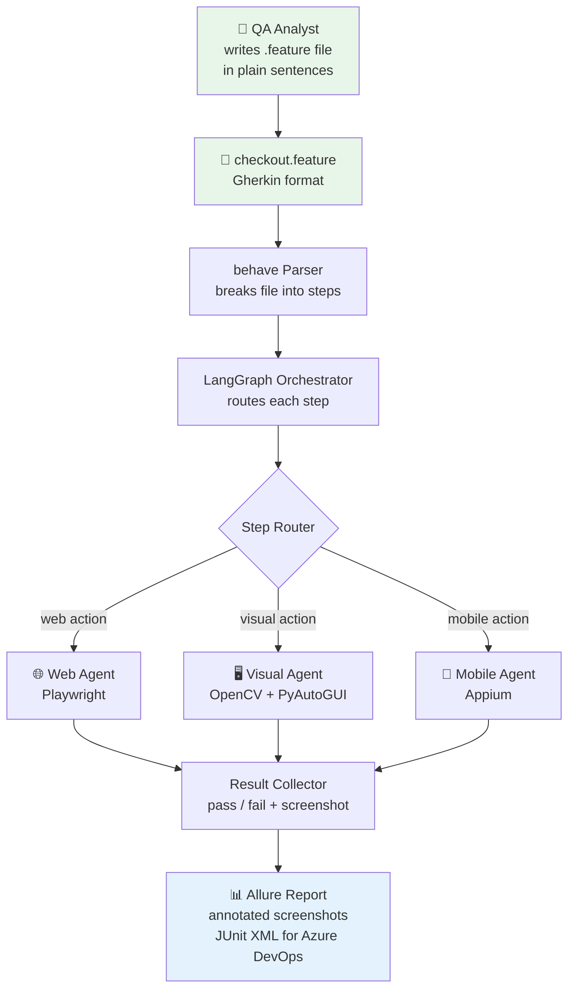

# BDDFrame — Design Documentation

## Core idea

A QA writes a `.feature` file in plain Gherkin sentences. No step definitions. No selectors. No code. BDDFrame reads each sentence, understands it with an LLM, and runs the test using Playwright (web), OpenCV (visual/desktop), or Appium (mobile).

## Overall architecture

## Phases

| Phase | Topic | Status |
|-------|-------|--------|
| [1 — Foundation](phase-01-foundation.md) | Parser, LLM backend, orchestrator, step resolver | Planned |
| [2 — Web Agent](phase-02-web-agent.md) | Playwright, intent locators, semantic assertions, self-healing | Planned |
| [3 — Visual Agent](phase-03-visual-agent.md) | OpenCV, OCR, vision LLM, desktop automation | Planned |
| [4 — Reporting](phase-04-reporting.md) | Allure, JUnit XML, annotated screenshots | Planned |
| [5 — CLI, Recorder & Azure DevOps](phase-05-cli-devops.md) | CLI, flow recorder, pipeline YAML | Planned |
| [6 — Syntax Highlighting](phase-06-syntax-highlighting.md) | VS Code extension, variable highlighting, tag autocomplete | Planned |

## Design principles

1. **The `.feature` file is the only QA artifact.** No Python, no YAML, no JSON config alongside it.
2. **Sentences over syntax.** Steps are plain English. The LLM interprets them — no regex matching.
3. **Accessibility tree before LLM.** Elements are found by role, label, and text first. LLM is the fallback, not the default.
4. **Semantic assertions.** "The screen should look the same as before" is a valid, runnable assertion.
5. **Evidence-first failures.** Every failure includes an annotated screenshot showing exactly what went wrong and where.
6. **All open source.** Every dependency has a permissive license.
