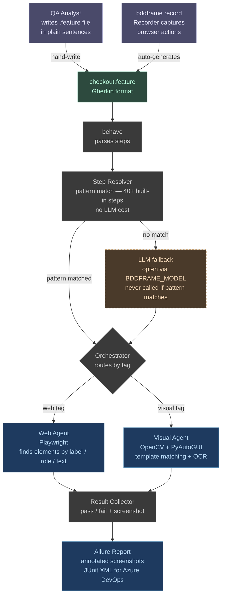

# BDDFrame — Design Documentation

## Core idea

A QA writes a `.feature` file in plain Gherkin sentences. No step definitions. No selectors. No code. BDDFrame reads each sentence, understands it with an LLM, and runs the test using Playwright (web), OpenCV (visual/desktop), or Appium (mobile).

## Overall architecture

## Phases

| Phase | Topic | Status |
|-------|-------|--------|
| [1 — Foundation](phase-01-foundation.md) | Parser, LLM backend, orchestrator, step resolver | Done |
| [2 — Web Agent](phase-02-web-agent.md) | Playwright, intent locators, semantic assertions, self-healing | Done |
| [3 — CLI & Hooks Hardening](phase-03-hardening.md) | Browser validation, env normalisation, cleanup guarantees | Done |
| [4 — Visual Agent](phase-04-visual-agent.md) | OpenCV template matching, OCR, vision LLM, desktop automation | Done |
| [5 — Reporting](phase-05-reporting.md) | Allure JSON, JUnit XML, annotated screenshots | Done |
| [6 — CLI, Recorder & Azure DevOps](phase-06-cli-devops.md) | CLI commands, flow recorder, pipeline YAML | Done |
| [7 — Syntax Highlighting](phase-07-syntax-highlighting.md) | VS Code extension, variable highlighting, tag autocomplete, LSP | Done |
| [8 — Test Development Guide](phase-08-test-development.md) | Feature file authoring, POM mapping strategy, multi-page flows | Done |
| [9 — Element Disambiguation](phase-09-element-disambiguation.md) | Correct-element resolution: ambiguity detection, page-scoped POM | Plan |
| [10 — Local Agent Framework (Foundry Local)](phase-10-foundry-local-agent.md) | Run Agent Framework on a locked-down network (no HF/Ollama) via Foundry Local; uv-first | Plan |
| [Writing a Test](writing-a-test.md) | Step-by-step: happy path + problematic locators | Guide |
| [Run Examples](run-examples.md) | Commands to see logs, the Allure report, and the Azure dashboard | Guide |
| [Resolution Hierarchy](resolution-hierarchy.md) | When the local agent vs an LLM handles each step | Reference |
| [The LLM](llm.md) | Model, triggers, the client module, orchestration, LLM-vs-OpenCV diagram | Reference |
| [POM Key Mapping](pom-key-mapping.md) | Exactly how step wording maps to pom.yaml keys, with examples | Reference |
| [Tech Stack](tech-stack.md) | Every library/tool, its version, and its purpose | Reference |

## Design principles

1. **The `.feature` file is the only QA artifact.** No Python, no YAML, no JSON config alongside it.
2. **Sentences over syntax.** Steps are plain English. The LLM interprets them — no regex matching.
3. **Accessibility tree before LLM.** Elements are found by role, label, and text first. LLM is the fallback, not the default.
4. **Semantic assertions.** "The screen should look the same as before" is a valid, runnable assertion.
5. **Evidence-first failures.** Every failure includes an annotated screenshot showing exactly what went wrong and where.
6. **All open source.** Every dependency has a permissive license.
