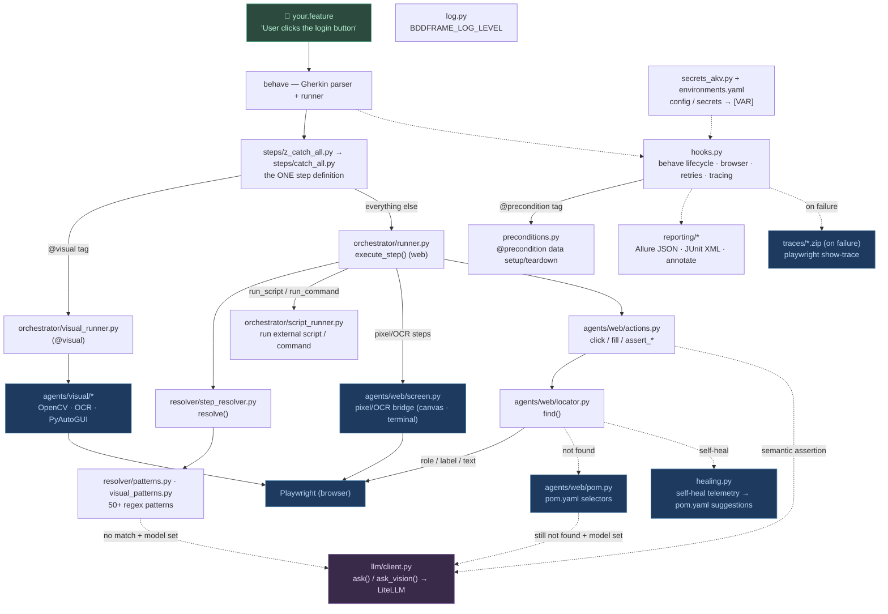
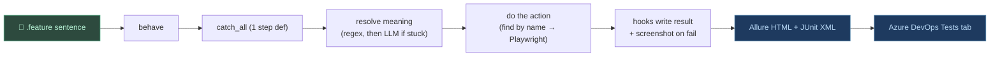
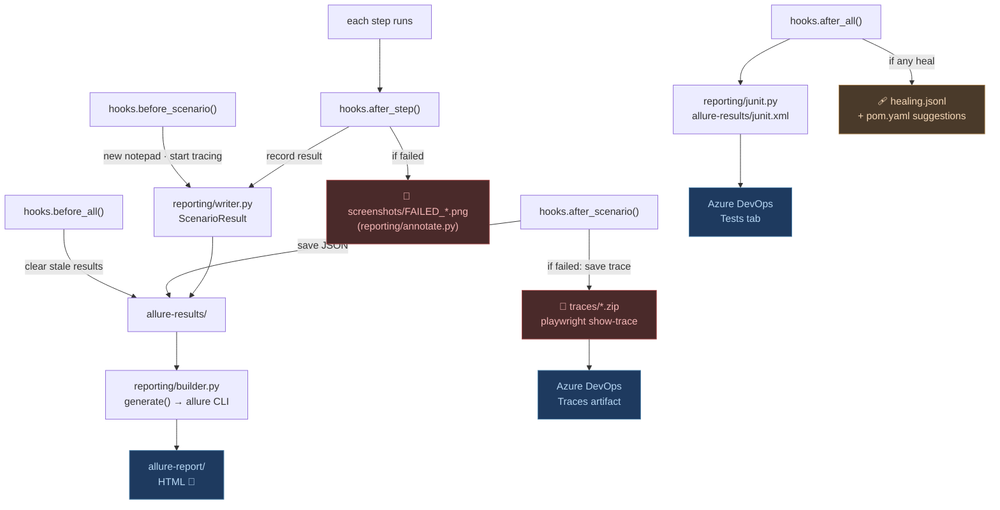

# Noodle Test Framework — The Tech, End to End

The one-stop reference for *how Noodle Test Framework actually works*. Read this the way you'd
study Selenium, Selenide, or Appium: the mental model first, then the request
lifecycle, the resolution hierarchy, the LLM layer, and the tech stack. Every
moving part is a real file in `noodle/`.

New here? Start with the **[Guide](guide.md)** (install → write → run). This page
is the deep dive behind it.

---

## Table of contents

1. [Mental model — vs Selenium / Selenide / Appium](#1-mental-model)
2. [The component map](#2-the-component-map)
3. [A step's lifecycle, start to finish](#3-a-steps-lifecycle)
4. [The resolution hierarchy — who handles each step](#4-the-resolution-hierarchy)
5. [The LLM layer — model, triggers, the client](#5-the-llm-layer)
6. [Where the report comes from](#6-where-the-report-comes-from)
7. [The tech stack — every library and why](#7-the-tech-stack)
8. [Design principles](#8-design-principles)

---

## 1. Mental model

You already know the tools Noodle Test Framework is reacting to. Here's the one-line diff.

| Tool | What *you* write | Locators |
|------|------------------|----------|
| **Selenium** | WebDriver code + step glue + Page Objects | `By.id("login-btn")` — by hand |
| **Selenide** | Concise fluent code + smart waits | `$("#login-btn")` — by hand, still in code |
| **Appium** | Selenium protocol for mobile + code | accessibility id / xpath — by hand |
| **Noodle Test Framework** | **one plain-English sentence** | none — found by role / label / text |

In Selenium-family tools you hand-write three layers: the test, the glue, and the
locator. Noodle Test Framework keeps only the sentence and infers the rest.

```java
// SELENIUM POM — you write ALL of this
@When("user clicks the login button")
public void clickLogin() { loginPage.clickLogin(); }       // 1) glue

public class LoginPage {
    private By loginBtn = By.id("login-button");            // 3) locator
    public void clickLogin() { driver.findElement(loginBtn).click(); }  // 2) page object
}
```

```gherkin
# BDDFRAME — you write ONLY this. No glue, no Page Object, no By.id.
When User clicks the login button
```



```mermaid
flowchart TB
    subgraph SEL["SELENIUM / SELENIDE / APPIUM — you write 3 things"]
        S1["Feature / test"] --> S2["Step definition<br/>(you write)"]
        S2 --> S3["Page Object / locator code<br/>(you write)"]
        S3 --> S4["By.id locator<br/>(you write)"]
        S4 --> S5["WebDriver acts"]
    end

    subgraph BDD["BDDFRAME — you write 1 thing"]
        B1["Feature sentence<br/>(you write)"] --> B2["catch-all step<br/>(built-in)"]
        B2 --> B3["resolver picks the action<br/>(built-in)"]
        B3 --> B4["locator finds it by role/label/text<br/>(built-in)"]
        B4 --> B5["Playwright acts"]
    end

    style S2 fill:#4a2a2a,color:#f5b8b8,stroke:#aa4a4a
    style S3 fill:#4a2a2a,color:#f5b8b8,stroke:#aa4a4a
    style S4 fill:#4a2a2a,color:#f5b8b8,stroke:#aa4a4a
    style B1 fill:#2d4a3e,color:#b8f5d8,stroke:#4aaa80
    style B2 fill:#3a3a3a,color:#d0d0d0,stroke:#666
    style B3 fill:#3a3a3a,color:#d0d0d0,stroke:#666
    style B4 fill:#3a3a3a,color:#d0d0d0,stroke:#666
```

Red = what you hand-write elsewhere and **don't** here. `pom.yaml` is the optional
cousin of `By.id` — you add it only for elements with no readable name (icon-only
buttons, legacy apps). See the **[Guide → POM YAML](guide.md#5-pomyaml--when-natural-naming-fails)**.

> **The whole framework is local and deterministic by default.** With no
> `BDDFRAME_MODEL` set there is no LLM: it's pattern matching + Playwright
> accessibility + POM + OpenCV. Anything those can't resolve **fails loudly with
> a screenshot** — it does not silently call a model. The LLM is opt-in and only
> ever a *fallback* (see [§5](#5-the-llm-layer)).

---

## 2. The component map

Each box below is a real module. This is the whole framework on one page.



| Layer | Module(s) | Job |
|-------|-----------|-----|
| **Parse** | `behave` | Read the `.feature` file into Feature → Scenario → Step. Noodle Test Framework uses behave's parser **and** its runner. |
| **Wire** | `noodle/steps/catch_all.py` (+ `features/steps/z_catch_all.py`) | One catch-all step definition receives *every* sentence. No per-step glue. |
| **Route** | `noodle/hooks.py` | Reads scenario tags → launches the right browser (or routes `@visual` to the desktop agent), and wires reporting into behave's lifecycle. |
| **Interpret** | `noodle/resolver/` | Turn a sentence into a structured action via regex; LLM fallback only if no pattern matches. |
| **Act (web)** | `noodle/agents/web/` | `actions.py` (do it) → `locator.py` (find it, accessibility-first) → `pom.py` (named selectors). |
| **Pixel/OCR bridge** | `noodle/agents/web/screen.py` | Canvas and terminal UIs with no semantic DOM: OCR-locates text in a Playwright screenshot (device-pixel coords converted to CSS-pixel mouse coords), then drives `page.mouse` / `page.keyboard`. Activated by the `focuses on`, `type_text`, `click_at`, `assert screen text` step family. |
| **Test data / scripts** | `noodle/orchestrator/script_runner.py`, `agents/web/actions.py` | Non-UI steps: run an external script/command (`run the script …`), call an API, mock a route, load a fixture. |
| **Preconditions** | `noodle/preconditions.py` | `@precondition:NAME` → seed data before a scenario and tear it down after (even on failure), from a per-folder `preconditions.yaml`. |
| **Act (visual)** | `noodle/agents/visual/` | OpenCV template match + Tesseract OCR + PyAutoGUI for non-DOM UIs. |
| **LLM** | `noodle/llm/client.py` | The single gateway to any model via LiteLLM. Reached only as a leaf-level fallback. |
| **Report** | `noodle/reporting/` | Allure JSON per step, JUnit XML for Azure, annotated failure screenshots. |
| **Trace** | `noodle/hooks.py` (Playwright tracing) | A `trace.zip` per **failed** scenario (DOM/network/timeline); discarded on pass. |
| **Heal telemetry** | `noodle/healing.py` | Records every self-heal / POM-disambiguation / vision-locate → `healing.jsonl` + `pom.yaml` suggestions. |
| **Agentic RCA** | `noodle/rca.py` | On a step **failure** (opt-in `BDDFRAME_RCA`), a vision model classifies the root cause → `rca_category` label on the Allure result. |
| **Secrets/config** | `noodle/secrets_akv.py`, `environments.yaml` | Base URLs + secrets (Azure Key Vault or `secrets.env`) resolved into `[VAR]`s. |
| **Log** | `noodle/log.py` | One logger, `BDDFRAME_LOG_LEVEL`. |
| **Drive** | `noodle/cli.py` | The `noodle` command (run, validate, list, record, report) + retry/quarantine exit code. |
| **Edit** | `noodle/lsp/` + `vscode-extension/` | LSP step validation, tag/variable autocomplete, syntax highlighting. |

---

## 3. A step's lifecycle

The actual path for a normal `@web` step, in plain words:

1. Your `.feature` sentence reaches **behave**, which hands **every** step to the one
   built-in `catch_all()`.
2. `catch_all` checks the tag: `@visual` → the desktop agent; otherwise → `execute_step()`.
3. `execute_step` **substitutes variables** (`[SAUCE_USERNAME]` → env value, `` `captured` `` → run store), then asks the **resolver**: *what does this sentence mean?*
4. The resolver tries 50+ regex patterns. Match → it returns an action dict (`click`, `fill`, `assert_visible`, …). No match → it calls the LLM **only if a model is configured** (Trigger 1).
5. The action runs through `actions.py`, which uses `locator.py` to **find the element by its readable name** — role / label / placeholder / text. No `By.id` needed.
6. Element not found? Try `pom.yaml`. Still not found? Vision LLM (Trigger 2) — again, only if a model is set.
7. Playwright performs the actual click/fill in the browser.
8. `hooks.py` records the result; on failure it snaps an annotated screenshot.



**One sentence to remember:** you write the *what* (a plain sentence); Noodle Test Framework
figures out the *how* (regex → find by name → POM → LLM only if stuck) and hands
you a screenshot-filled report.

---

## 4. The resolution hierarchy

This is the single source of truth for **when local logic runs vs when an LLM
takes over**. A step passes through up to four levels; at each one the **local**
path is tried first, and the **LLM** path is a labelled fallback that fires only
under the stated condition (and only if the env var is set — otherwise the step
fails).

```mermaid
flowchart TD
    S["Gherkin step"] --> L0

    subgraph L0["① Interpret the sentence — resolver"]
        P["Pattern match (50+ regex)\nLOCAL · no cost"] -->|matched| OUT0["action"]
        P -->|no match| LLM0["LLM step fallback\nonly if BDDFRAME_MODEL set\nelse: step FAILS"]
        LLM0 --> OUT0
    end

    OUT0 --> L1{"② Route by tag"}
    L1 -->|@visual| VIS
    L1 -->|web default| WEB

    subgraph WEB["③ Web — find the element (locator.find)"]
        A["Accessibility tree\nrole / label / placeholder / text\nLOCAL"] -->|exactly 1| HIT["use it"]
        A -->|2+ matches| AMB["POM scoped entry?\nLOCAL → yes: use it"]
        AMB -->|no entry| MODE["strict: FAIL · lenient: first + warn"]
        A -->|0| HEAL["scroll, then partial-word retry\nLOCAL"]
        HEAL -->|found| HIT
        HEAL -->|still 0| POM["POM YAML\npage-scoped → shared → flat\nLOCAL"]
        POM -->|found| HIT
        POM -->|not found| VL["Vision LLM locate\nonly if BDDFRAME_MODEL set\nelse: step FAILS"]
        VL --> HIT
    end

    subgraph VIS["③ Visual — find on screen"]
        T["OpenCV template match + OCR\nLOCAL"] -->|found| HIT2["use coords"]
        T -->|not found| VL2["Vision LLM locate\nonly if BDDFRAME_VISION_MODEL set\nelse: step FAILS"]
        VL2 --> HIT2
    end

    HIT --> L3
    HIT2 --> L3

    subgraph L3["④ Assertions"]
        ST["Structural: text / url / title\nLOCAL"]
        SE["Semantic / visual-baseline\nALWAYS vision LLM — requires BDDFRAME_MODEL"]
    end

    style P fill:#1e3a5f,color:#b8d8f5,stroke:#4a80aa
    style A fill:#1e3a5f,color:#b8d8f5,stroke:#4a80aa
    style POM fill:#1e3a5f,color:#b8d8f5,stroke:#4a80aa
    style T fill:#1e3a5f,color:#b8d8f5,stroke:#4a80aa
    style ST fill:#1e3a5f,color:#b8d8f5,stroke:#4a80aa
    style LLM0 fill:#4a3a2a,color:#f5d8b8,stroke:#aa804a,stroke-dasharray:4 4
    style VL fill:#4a3a2a,color:#f5d8b8,stroke:#aa804a,stroke-dasharray:4 4
    style VL2 fill:#4a3a2a,color:#f5d8b8,stroke:#aa804a,stroke-dasharray:4 4
    style SE fill:#4a3a2a,color:#f5d8b8,stroke:#aa804a,stroke-dasharray:4 4
```

**Level ① — interpret the sentence** (`resolver/step_resolver.py`). Pattern match
covers most steps for free. The LLM is asked for a JSON action only when every
regex misses **and** `BDDFRAME_MODEL` is set; otherwise the step fails.

**Level ② — route by tag** (`steps/catch_all.py`). `@visual` → desktop/OpenCV
agent; everything else → web/Playwright. Local and free.

**Level ③ (web) — find the element** (`agents/web/locator.py`), in order:
1. **Accessibility tree** — role, label, placeholder, title, text. A *unique* match is used immediately.
2. **Ambiguous** (2+ matches) → consult **POM** for a scoped selector. No entry → strict mode **fails** with the candidate list; lenient (default) warns and uses the first match.
3. **Self-heal** — scroll and retry, then first-word partial match.
4. **POM YAML** — page-scoped block → `shared:` → flat keys.
5. **Vision LLM locate** — screenshot → "give me a CSS selector". Only if `BDDFRAME_MODEL` is set.

**Level ③ (visual) — find on screen** (`orchestrator/visual_runner.py`): OpenCV
template match + OCR, then vision-LLM-locate-by-description only if
`BDDFRAME_VISION_MODEL` is set.

**Level ④ — assertions**: structural checks (`should see`, `url containing`,
`page title`) are direct DOM/text — never an LLM. Semantic / visual-baseline
assertions (`the X should show…`, `the screen should look the same as before`)
are **always** a vision LLM call and require `BDDFRAME_MODEL`.

### "What runs for this step?"

| Step | Resolves via |
|------|--------------|
| `User clicks the login button` (button reads "Login") | Local — accessibility |
| `User clicks the burger menu` (icon-only) | Local — POM YAML |
| `User clicks "Add to cart"` (six on page) | Local — POM if scoped; else first-match (lenient) or FAIL (strict) |
| `User should see "Products"` | Local — DOM text |
| `` `total` should be greater than "0" `` | Local — comparison assertion |
| `User enters X in the obscure_widget` (no label, no POM, model set) | LLM — vision locate |
| `User submits the login form` (verb not in patterns, model set) | LLM — step fallback |
| `the dashboard should show a healthy state` | LLM — semantic assertion (required) |
| `I click image "save.png"` (`@visual`) | Local — OpenCV template match |

### Strict mode — fail instead of guess

By default ambiguity is lenient (warn + first match) so suites stay green. For CI
you usually want it to **fail** so wrong-element bugs surface:

```bash
BDDFRAME_STRICT_LOCATOR=true      # whole run
```
```gherkin
@strict
Scenario: ...                      # this scenario only
```

---

## 5. The LLM layer

What model is used, what triggers it, and the one module that handles it.

### Model-agnostic by design

Noodle Test Framework talks to whatever **[LiteLLM](https://github.com/BerriAI/litellm)**
supports, through one provider/model string. There is no hard-coded vendor — you
pick the model in `.env`.

| Setting | Env var | Notes |
|---------|---------|-------|
| Model id (LiteLLM format) | `BDDFRAME_MODEL` | e.g. `ollama/llama3`, `openai/gpt-4o`, `anthropic/claude-sonnet-4-6`. **Unset by default → no LLM.** |
| API base URL | `BDDFRAME_LLM_URL` | e.g. `http://localhost:11434` (Ollama) or `https://api.openai.com/v1`. Not required for Anthropic/Gemini/Groq. |
| Desktop/visual model | `BDDFRAME_VISION_MODEL` | gates only the `@visual` image fallback |
| Resolution mode | `BDDFRAME_LLM_MODE` | `auto` (default) — patterns first, LLM on no-match; `full` — LLM resolves every step, patterns skipped. Requires `BDDFRAME_MODEL`. |

Features that send a screenshot (vision-locate, semantic assertions) need a
**vision-capable** model (`openai/gpt-4o`, `ollama/llava`, `anthropic/claude-sonnet-4-6`,
`gemini/gemini-1.5-flash`, …). Because LiteLLM speaks OpenAI-compatible endpoints,
the same config drives Ollama, hosted OpenAI, Anthropic Claude, Google Gemini, Groq,
**or [Foundry Local](https://learn.microsoft.com/azure/foundry-local/)** (a local
model runtime that works on networks where Ollama/Hugging Face are blocked) with
**zero code changes** — see [Design History → Phase 10](design-history.md#phase-10--foundry-local).

Install the dependency (LiteLLM is the only LLM dep):

```bash
uv pip install -e ".[llm]"     # or: pip install -e ".[llm]"
```

### The client module

One thin module — **`noodle/llm/client.py`** — two functions, no class hierarchy:

| Function | Purpose | Reads |
|----------|---------|-------|
| `ask(prompt) -> str` | text completion (step interpretation) | `BDDFRAME_MODEL`, `BDDFRAME_LLM_URL` |
| `ask_vision(prompt, image_b64) -> str` | text + screenshot (locate / assert) | `BDDFRAME_MODEL`, `BDDFRAME_LLM_URL` |

`litellm` is imported lazily, so the framework imports and runs with **no LLM
extra installed** — you only hit the import error if you actually trigger an LLM
path without `".[llm]"`. Everything else *calls* this module; nothing else talks
to a model directly.

### The four triggers (`auto` mode)

Each is a local layer failing **plus** the matching env var being set. If the var
is unset, the step fails locally instead — the LLM is never called.

| # | Trigger (local layer missed) | Caller | Function | Gate |
|---|------------------------------|--------|----------|------|
| 1 | No regex pattern matched the sentence | `resolver/step_resolver.py` | `ask` | `BDDFRAME_MODEL` |
| 2 | Web element not found by accessibility + POM | `agents/web/locator.py` | `ask_vision` | `BDDFRAME_MODEL` |
| 3 | Semantic / visual-baseline assertion | `agents/web/actions.py` | `ask_vision` | `BDDFRAME_MODEL` |
| 4 | `@visual` image not found by OpenCV/OCR | `agents/visual/vision_locate.py` | `ask_vision` | `BDDFRAME_VISION_MODEL` |

Note the split: triggers 1–3 (web path) gate on `BDDFRAME_MODEL`; trigger 4
(desktop path) gates on `BDDFRAME_VISION_MODEL`.

### Full LLM mode (`BDDFRAME_LLM_MODE=full`)

Setting `BDDFRAME_LLM_MODE=full` promotes the LLM from fallback to **primary**
resolver for both step interpretation and element location. Patterns are not
consulted. `BDDFRAME_MODEL` must be set and vision-capable for the locator path.

```mermaid
flowchart TD
    STEP["Gherkin step"] --> MODE{"BDDFRAME_LLM_MODE"}

    MODE -->|auto default| RES["Resolver: 50+ regex patterns<br/>LOCAL"]
    RES -->|matched| ROUTE{"route by tag"}
    RES -->|no match| T1F["ask() fallback<br/>BDDFRAME_MODEL"]
    T1F --> ROUTE

    MODE -->|full| T1["ask() — primary resolver<br/>patterns skipped<br/>BDDFRAME_MODEL required"]
    T1 --> ROUTE

    ROUTE -->|web · auto| PW["Playwright accessibility<br/>LOCAL → POM → ask_vision()"]
    ROUTE -->|web · full| VL["ask_vision() — primary locator<br/>accessibility as safety net"]
    ROUTE -->|@visual| CV["OpenCV + OCR<br/>LOCAL"]

    T1 -.calls.-> CLIENT["llm/client.py → LiteLLM"]
    T1F -.calls.-> CLIENT
    PW -.fallback.-> CLIENT
    VL -.calls.-> CLIENT

    style RES fill:#1e3a5f,color:#b8d8f5,stroke:#4a80aa
    style PW fill:#1e3a5f,color:#b8d8f5,stroke:#4a80aa
    style CV fill:#1e3a5f,color:#b8d8f5,stroke:#4a80aa
    style T1 fill:#4a3a2a,color:#f5d8b8,stroke:#aa804a
    style T1F fill:#4a3a2a,color:#f5d8b8,stroke:#aa804a,stroke-dasharray:4 4
    style VL fill:#4a3a2a,color:#f5d8b8,stroke:#aa804a
    style CLIENT fill:#3a2a4a,color:#e8d8f5,stroke:#8a6aaa
```

**Trade-off:** `full` mode is slower (one LLM call per step) and costs money with
hosted models. Use `auto` for CI and regression suites. Use `full` for exploratory
testing, legacy app automation, or any scenario where the step vocabulary is too
rich or too inconsistent to pattern-match upfront.

```mermaid
flowchart TD
    STEP["Gherkin step"] --> RES["Resolver: 50+ regex patterns<br/>LOCAL"]
    RES -->|matched| ROUTE{"route by tag"}
    RES -->|no match| T1["ask() — step fallback<br/>trigger 1 · BDDFRAME_MODEL"]
    T1 --> ROUTE

    ROUTE -->|web| PW["Playwright accessibility<br/>role / label / text · LOCAL"]
    ROUTE -->|@visual| CV["OpenCV template + OCR<br/>LOCAL"]

    PW -->|found| ACT["run web action"]
    PW -->|not found| POM["POM YAML · LOCAL"]
    POM -->|found| ACT
    POM -->|not found| T2["ask_vision() — vision locate<br/>trigger 2 · BDDFRAME_MODEL"]
    T2 --> ACT

    CV -->|found| VACT["run visual action"]
    CV -->|not found| T4["ask_vision() — locate by description<br/>trigger 4 · BDDFRAME_VISION_MODEL"]

    ACT --> ASSERT{"assertion?"}
    ASSERT -->|structural: text/url/title| LOCALA["DOM check · LOCAL"]
    ASSERT -->|semantic / baseline| T3["ask_vision() — semantic assert<br/>trigger 3 · BDDFRAME_MODEL"]

    T1 -.calls.-> CLIENT["llm/client.py<br/>ask · ask_vision → LiteLLM"]
    T2 -.calls.-> CLIENT
    T3 -.calls.-> CLIENT
    T4 -.calls.-> CLIENT

    style RES fill:#1e3a5f,color:#b8d8f5,stroke:#4a80aa
    style PW fill:#1e3a5f,color:#b8d8f5,stroke:#4a80aa
    style CV fill:#1e3a5f,color:#b8d8f5,stroke:#4a80aa
    style POM fill:#1e3a5f,color:#b8d8f5,stroke:#4a80aa
    style LOCALA fill:#1e3a5f,color:#b8d8f5,stroke:#4a80aa
    style T1 fill:#4a3a2a,color:#f5d8b8,stroke:#aa804a,stroke-dasharray:4 4
    style T2 fill:#4a3a2a,color:#f5d8b8,stroke:#aa804a,stroke-dasharray:4 4
    style T3 fill:#4a3a2a,color:#f5d8b8,stroke:#aa804a,stroke-dasharray:4 4
    style T4 fill:#4a3a2a,color:#f5d8b8,stroke:#aa804a,stroke-dasharray:4 4
    style CLIENT fill:#3a2a4a,color:#e8d8f5,stroke:#8a6aaa
```

Blue = local (never costs an LLM call). Orange dashed = the four LLM fallbacks,
all funnelling into `client.py`. The LLM is always **downstream** of OpenCV and
Playwright — it only runs when the local engine on that branch came up empty and
the env var is set.

### The sample test that triggers the LLM

`features/web/fallback-demo/llm_fallback.feature` exists to demonstrate **Trigger 1**.
Every step resolves locally except one:

```gherkin
@web @headless @llm_fallback
Feature: LLM Fallback Demonstration

  Scenario: A step the regex layer can't parse is interpreted by the model

    Given User is on "https://www.saucedemo.com"             # [A11Y] pattern match
    When User enters [SAUCE_USERNAME] in the username field  # [A11Y] placeholder
    And User enters [SAUCE_PASSWORD] in the password field   # [A11Y] placeholder
    When User submits the login form                         # [LLM]  no pattern → model
    Then User should see "Products"                          # [A11Y] DOM text
```

The verb **"submits"** is in no regex pattern, so `step_resolver` hands the
sentence to the model, which returns an action like `{"type":"click","locator":"Login"}`.

Run it (needs a model — with `BDDFRAME_MODEL` unset, the `[LLM]` step fails by design):

```bash
# .env: BDDFRAME_MODEL=ollama/llama3  (or a Foundry Local / OpenAI id) + BDDFRAME_LLM_URL
noodle run features/web/fallback-demo/llm_fallback.feature --headed
```

To watch the raw prompt/response exchange:

```bash
uv run --with litellm --with pytest python -m pytest unit_tests/test_llm_openai_endpoint.py -s
```

### Config recap

```bash
# ── auto mode (default) ───────────────────────────────────────────────────────

# Local, free (Ollama) — text fallback only
BDDFRAME_MODEL=ollama/llama3
BDDFRAME_LLM_URL=http://localhost:11434

# Local vision (Ollama llava) — web locate + semantic assertions
BDDFRAME_MODEL=ollama/llava
BDDFRAME_LLM_URL=http://localhost:11434

# Anthropic Claude — vision-capable, no BDDFRAME_LLM_URL needed
BDDFRAME_MODEL=anthropic/claude-sonnet-4-6
ANTHROPIC_API_KEY=sk-ant-...

# Google Gemini — free tier, vision-capable
BDDFRAME_MODEL=gemini/gemini-1.5-flash
GEMINI_API_KEY=...

# Groq — free tier, text only (no vision)
BDDFRAME_MODEL=groq/llama-3.1-8b-instant
GROQ_API_KEY=...

# OpenAI
BDDFRAME_MODEL=openai/gpt-4o-mini
BDDFRAME_LLM_URL=https://api.openai.com/v1
OPENAI_API_KEY=sk-...

# Desktop @visual image fallback
BDDFRAME_VISION_MODEL=ollama/llava     # or anthropic/claude-sonnet-4-6 / gpt-4o

# ── full LLM mode ─────────────────────────────────────────────────────────────
# Every step resolved by the model. Patterns skipped. Requires a vision-capable
# model for element location. Slower and costs more — not recommended for CI.
BDDFRAME_LLM_MODE=full
BDDFRAME_MODEL=anthropic/claude-sonnet-4-6
ANTHROPIC_API_KEY=sk-ant-...
```

Leave them all unset for a deterministic, zero-cost, fully-local run — the
recommended CI baseline.

---

## 6. Where the report comes from

`hooks.py` watches every scenario via behave's lifecycle and turns the results
into an Allure report + Azure-ready JUnit XML.



- `before_all` clears stale `allure-results/` so the report + quarantine scan reflect only this run.
- `before_scenario` starts a fresh `ScenarioResult` **and** Playwright tracing.
- After **each step**, `after_step` records the result and, **on failure**, snaps a full-page screenshot (annotated by `annotate.py` with Pillow). If `BDDFRAME_RCA` is on, `rca.py` then classifies the failure's root cause from that screenshot and tags the result with an `rca_category` label (best-effort, never raises).
- `after_scenario` saves the result as JSON; on failure it also writes `traces/<scenario>.zip` (trace discarded on pass).
- `after_all` writes one `junit.xml` (Azure's Tests tab) and, if any locator healed, the `healing.jsonl` + report.
- `builder.py` shells out to the **Allure CLI** to render `allure-results/` → `allure-report/` HTML.

Compared to Selenium: like TestNG/JUnit reports + a screenshot listener, except
it's built in and also produces Allure + Azure-ready JUnit with failure
screenshots attached automatically. See **[Guide → Reports](guide.md#8-reports)**
for the commands.

---

## 7. The tech stack

Every library, the declared minimum from `pyproject.toml` (the wheel may install
newer), and why it's here.

### Language & tooling

| Tech | Version | Purpose |
|------|---------|---------|
| Python | `>=3.11` | Framework language (uses `tomllib`, modern typing). |
| **uv** | latest | Dependency manager / runner. The project ships `uv.lock`; `pip` also works. |
| Node.js + npm | extension only | Builds the VS Code extension. Not needed to run tests. |

### Core dependencies (always installed)

| Library | Min | Purpose |
|---------|-----|---------|
| [behave](https://behave.readthedocs.io/) | `1.2.6` | BDD runner — parses Gherkin and drives each step. **Synchronous**, which is why Playwright's sync API is used. |
| [playwright](https://playwright.dev/python/) | `1.40.0` | Browser automation (Web Agent). Sync API. Chromium / Firefox / WebKit. |
| [typer](https://typer.tiangolo.com/) | `0.9.0` | The `noodle` CLI. |
| [python-dotenv](https://github.com/theskumar/python-dotenv) | `1.0.0` | Loads `.env` config + credentials. |
| [pillow](https://python-pillow.org/) | `10.0.0` | Screenshot annotation **and deterministic pixel-diff baselines** (`pixel_baseline`). |
| [pyyaml](https://pyyaml.org/) | `6.0` | Parses `pom.yaml`. |

### Optional extras

| Extra | Library (min) | Purpose |
|-------|---------------|---------|
| `[llm]` | [litellm](https://github.com/BerriAI/litellm) `1.0.0` | One interface to any model; the only LLM dep. |
| `[lsp]` | [pygls](https://github.com/openlawlibrary/pygls) `1.3.0`, [lsprotocol](https://github.com/microsoft/lsprotocol) `2023.0.0` | VS Code step validation/autocomplete. |
| `[reporting]` | [allure-python-commons](https://github.com/allure-framework/allure-python) `2.13.0` | Emits Allure result JSON. |
| `[visual]` | [opencv-python](https://github.com/opencv/opencv-python) `4.8.0`, [pytesseract](https://github.com/madmaze/pytesseract) `0.3.10`, [pyautogui](https://github.com/asweigart/pyautogui) `0.9.54`, [mss](https://github.com/BoboTiG/python-mss) `9.0.1` | Template matching, OCR, desktop control, screen capture. |
| `[azure]` | [azure-identity](https://github.com/Azure/azure-sdk-for-python) `1.15.0`, [azure-keyvault-secrets](https://github.com/Azure/azure-sdk-for-python) `4.7.0` | Load secrets from Azure Key Vault (managed identity). |
| `[all]` | all of the above | Everything. |

### External binaries (not pip/uv installed)

| Thing | Install via | Purpose |
|-------|-------------|---------|
| Playwright browsers | `playwright install chromium` | The actual browser binaries. |
| [Tesseract OCR](https://github.com/tesseract-ocr/tesseract) | `brew` / `apt` / `winget` | OCR engine `pytesseract` calls (for `@visual`). |
| [Allure CLI](https://allurereport.org/) | `brew` / scoop / npm | Renders Allure JSON → HTML. |
| [Foundry Local](https://learn.microsoft.com/azure/foundry-local/) (opt.) | `winget` / `brew` | Local OpenAI-compatible model runtime for locked-down networks. |
| Ollama (opt.) | ollama.com | Local model runtime — free, simplest for laptops. |

### Dev / CI

| Tech | Purpose |
|------|---------|
| [pytest](https://pytest.org/) | The `unit_tests/` suite — **251 tests, no browser/LLM/display needed**. `make test`. |
| Makefile | `make test`, `make vsix`, `make install-ext`, `make clean`. |
| Azure Pipelines | `azure-pipelines.yml` (Linux) + `azure-pipelines-windows.yml` (Windows) — feature-folder **matrix sharding**, publish JUnit + Allure + failure traces. |
| Docker / devcontainer | `Dockerfile` (Playwright base image, browsers preinstalled) + `.devcontainer/` for reproducible CI and local parity. |

---

## 8. Design principles

1. **The `.feature` file is the only QA artifact.** No Python, no JSON config alongside it. `pom.yaml` is the one optional escape hatch.
2. **Sentences over syntax.** Steps are plain English; the resolver interprets them.
3. **Accessibility before LLM.** Elements are found by role/label/text first. The LLM is a fallback, never the default.
4. **Local and deterministic by default.** No model configured → no model calls. Unresolvable steps fail loudly with a screenshot.
5. **Evidence-first failures.** Every failure includes an annotated screenshot showing what went wrong and where.
6. **All open source.** Every dependency has a permissive licence.

For the chronological "how each capability got built" record, see
**[Design History](design-history.md)**.
</content>
