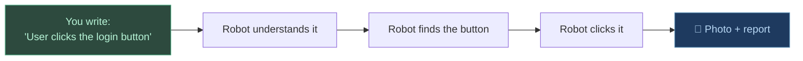
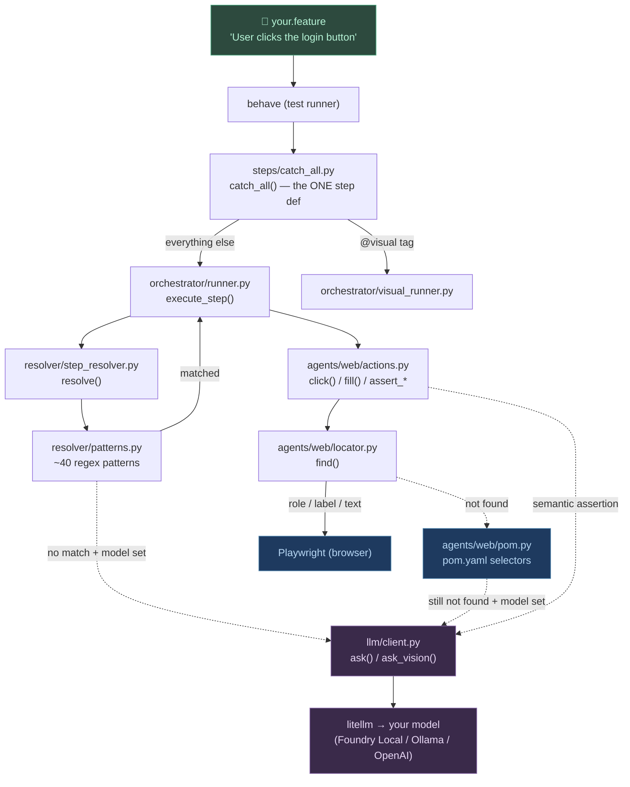
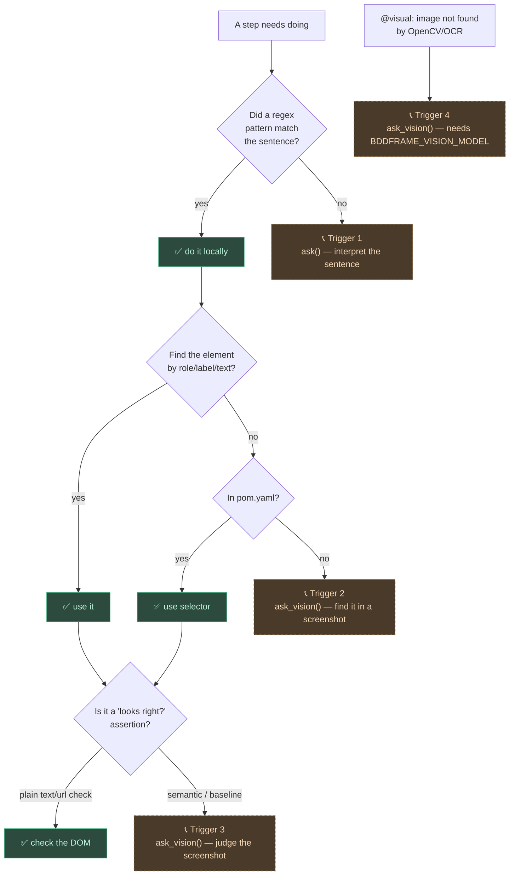
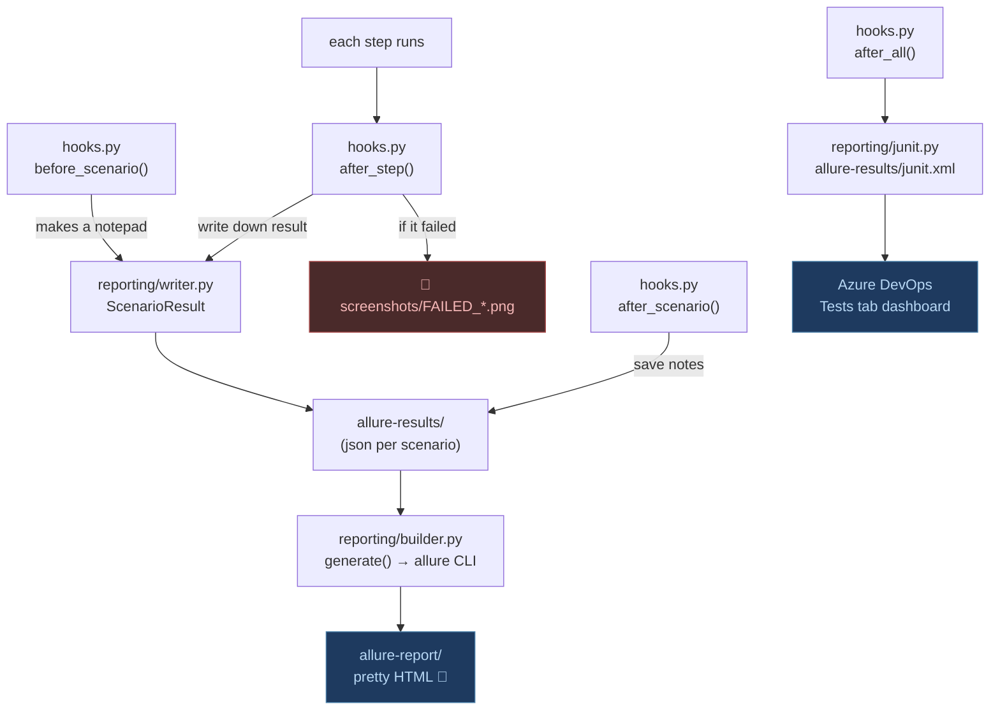
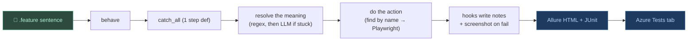

# How BDDFrame Works — Explained Like You're 5 (with a Selenium POM example)

You write a sentence. A robot reads it, does it in a browser, and takes a photo
if it breaks. That's it. The rest of this page shows *who does what* with
pictures, using **Selenium Page Object Model (POM)** as the thing you already
know.

---

## The big idea in one breath

**Old way (Selenium POM):** you write the test *and* all the plumbing — step
definitions, Page Object classes, and `By.id(...)` locators for every button.

**BDDFrame way:** you write **only the sentence**. The framework figures out the
plumbing for you. If it ever gets stuck, *then* (and only then) it phones a smart
friend (the LLM) for help.



---

## Selenium POM vs BDDFrame — same job, less work

In Selenium you hand-write three layers. In BDDFrame two of them disappear.

```java
// SELENIUM POM — you write ALL of this
// 1) the step definition (glue)
@When("user clicks the login button")
public void clickLogin() { loginPage.clickLogin(); }

// 2) the Page Object class
public class LoginPage {
    private By loginBtn = By.id("login-button");      // 3) the locator
    public void clickLogin() { driver.findElement(loginBtn).click(); }
}
```

```gherkin
# BDDFRAME — you write ONLY this. No glue, no Page Object, no By.id.
When User clicks the login button
```

Who writes what:

```mermaid
flowchart TB
    subgraph SEL["SELENIUM POM (you write 3 things)"]
        S1["Feature/test"] --> S2["Step definition<br/>(you write)"]
        S2 --> S3["Page Object class<br/>(you write)"]
        S3 --> S4["By.id locator<br/>(you write)"]
        S4 --> S5["WebDriver clicks"]
    end

    subgraph BDD["BDDFRAME (you write 1 thing)"]
        B1["Feature sentence<br/>(you write)"] --> B2["Catch-all step<br/>(built-in)"]
        B2 --> B3["Resolver figures out the action<br/>(built-in)"]
        B3 --> B4["Locator finds it by role/label/text<br/>(built-in)"]
        B4 --> B5["Playwright clicks"]
    end

    style S2 fill:#4a2a2a,color:#f5b8b8,stroke:#aa4a4a
    style S3 fill:#4a2a2a,color:#f5b8b8,stroke:#aa4a4a
    style S4 fill:#4a2a2a,color:#f5b8b8,stroke:#aa4a4a
    style B1 fill:#2d4a3e,color:#b8f5d8,stroke:#4aaa80
    style B2 fill:#3a3a3a,color:#d0d0d0,stroke:#666
    style B3 fill:#3a3a3a,color:#d0d0d0,stroke:#666
    style B4 fill:#3a3a3a,color:#d0d0d0,stroke:#666
```



Red = stuff *you* hand-write in Selenium and **don't** in BDDFrame.
The `pom.yaml` in BDDFrame is the *optional* cousin of `By.id` — you only add it
for tricky buttons that have no readable name (like an icon-only menu).

---

## Who calls whom (the real classes)

This is the actual code path for a normal `@web` step. Each box is a real file.



**Plain words:**
1. Your `.feature` sentence goes to `behave`.
2. `behave` hands **every** sentence to one built-in step: `catch_all()`.
3. `catch_all` looks at the tag: `@visual` → the picture robot; otherwise → the
   web robot `execute_step()`.
4. `execute_step` asks the **resolver**: "what does this sentence mean?"
5. The resolver tries ~40 regex patterns. Match → it returns an action
   (`click`, `fill`, ...). No match → it phones the LLM (only if a model is set).
6. The action runs through `actions.py`, which uses `locator.py` to **find the
   button by its readable name** (role/label/text — no `By.id` needed).
7. Can't find it? Try `pom.yaml`. Still can't? Phone the LLM (if a model is set).
8. Playwright does the actual click in the browser.

---

## When does the LLM (the smart friend) get called?

**Almost never.** It's the *last* resort, and only if you gave it a phone number
(`BDDFRAME_MODEL`). If everything local works, the LLM is never called and costs
nothing.



The 4 phone calls, all of which go through `llm/client.py`:

| # | When | Function |
|---|------|----------|
| 1 | The sentence matches no pattern | `ask()` |
| 2 | A button isn't found by name *or* pom.yaml | `ask_vision()` |
| 3 | A "looks right?" / "same as before?" assertion | `ask_vision()` |
| 4 | A `@visual` image isn't found by OpenCV/OCR | `ask_vision()` |

> **Selenium comparison:** there's no equivalent in Selenium — there, if your
> `By.id` is wrong, the test just fails. BDDFrame's LLM is the safety net that
> tries to recover (self-healing) before giving up.

---

## Where does the report come from?

A helper called **hooks** watches every scenario and writes down what happened.
At the end it turns those notes into the Allure report.



**Plain words:**
- `before_scenario` starts a fresh notepad (`ScenarioResult`).
- After **each step**, `after_step` writes the result and, **if it failed,
  snaps a full-page screenshot** into `screenshots/`.
- `after_scenario` saves the notepad as JSON into `allure-results/`.
- `after_all` writes one `junit.xml` (this is what Azure DevOps reads).
- Later, `builder.py` runs the **Allure CLI** to turn `allure-results/` into the
  pretty `allure-report/` HTML.

> **Selenium comparison:** like TestNG/JUnit reports + a screenshot listener —
> except here it's built in and also produces Allure + Azure-ready JUnit with
> failure screenshots attached automatically.

To actually open it, see [run-examples.md](run-examples.md).

---

## The whole story, start to finish



**One sentence to remember:** you write the *what* (a plain sentence); BDDFrame
figures out the *how* (regex → find by name → POM → LLM only if stuck) and
hands you a photo-filled report.
