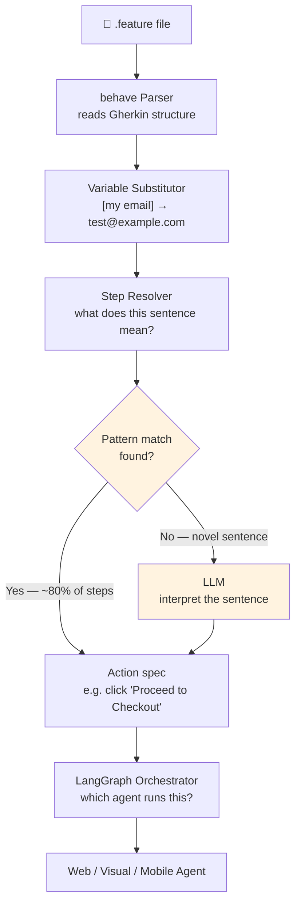
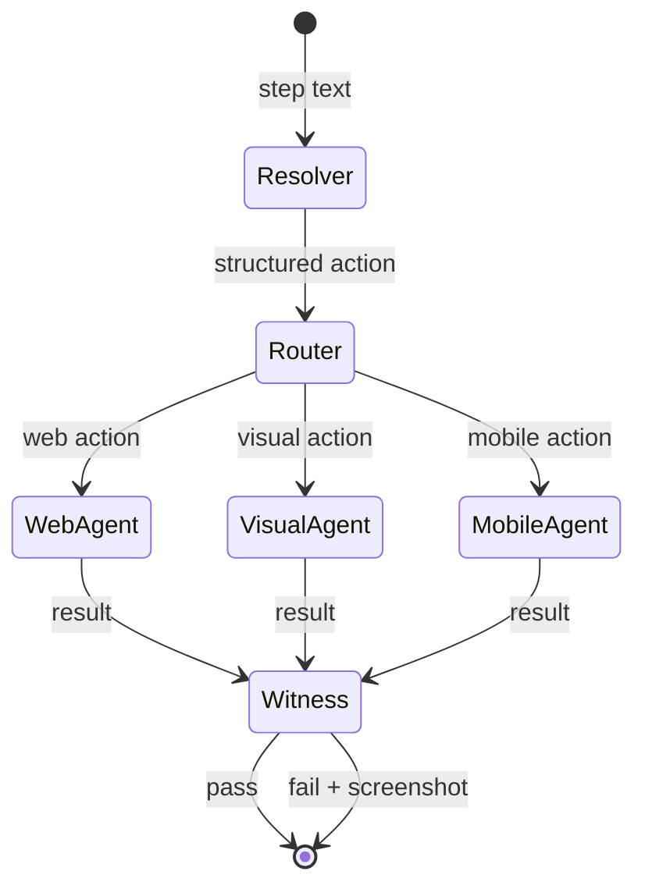

# Phase 1 — Foundation

**Goal**: Read the `.feature` file, understand each step, route it to the right agent.

---

## Explain like I'm 5

Imagine the `.feature` file is a to-do list written in plain English. The foundation is the person who reads each item on the list, figures out what it means, and hands it to the right worker — "this one's for the browser guy, this one's for the camera guy."

---

## Architecture



---

## Component 1: behave parser

`behave` reads the `.feature` file and gives us structured data. We use only its parser — no step definitions, no test runner from behave itself.

```python
from behave.parser import Parser

def load_feature(path: str):
    return Parser().parse(open(path).read())
    # returns: feature.name, feature.scenarios
    # each scenario has: scenario.name, scenario.tags, scenario.steps
    # each step has: step.keyword ("Given"/"When"/"Then"), step.name (the sentence)
```

What we get per step:

| Field | Example value |
|-------|--------------|
| `step.keyword` | `When` |
| `step.name` | `I enter [my email] in the email field` |
| `step.tags` | `['smoke', 'web']` |

---

## Component 2: variable substitution

Before any step is processed, `[my email]` becomes the actual value.

Resolution order:
1. `.env` file in the project root
2. Environment variable (CI pipeline injects these)
3. `bddframe.config.yaml` (optional, for non-secret values like `BASE_URL`)

```python
import re, os

def substitute(step_text: str) -> str:
    return re.sub(
        r'\[([^\]]+)\]',
        lambda m: os.getenv(m.group(1).upper().replace(" ", "_"), m.group(0)),
        step_text
    )
# "[my email]" → os.getenv("MY_EMAIL") → "test@example.com"
```

If the variable is not found, it stays as `[my email]` and a warning is logged. Test still runs — useful for exploratory runs.

---

## Component 3: step resolver (two-tier)

**Tier 1 — pattern match** (fast, no LLM cost, covers ~80% of steps):

```python
PATTERNS = [
    (r"I go to (.+)",              "navigate", ["url"]),
    (r"I click (.+)",              "click",    ["locator"]),
    (r"I enter (.+) in (.+)",      "fill",     ["value", "locator"]),
    (r"I should see (.+)",         "assert_visible", ["text"]),
    (r"I should not see (.+)",     "assert_hidden",  ["text"]),
    (r"the screen should look the same as before", "visual_baseline", []),
]
```

**Tier 2 — LLM fallback** (novel or ambiguous sentences):

```python
RESOLVER_PROMPT = """
You are a test automation interpreter.
Convert this test step into a structured action.

Step: "{step}"
Page context: {page_title}

Reply with JSON only:
{{"action": "click|fill|navigate|assert_visible|assert_semantic|visual_baseline",
  "locator": "...",
  "value": "..."}}
"""
```

The LLM receives the step text and the current page title as context. It returns a structured action. No hallucinated URLs — it works with what's on screen.

---

## Component 4: LLM backend (LiteLLM)

Single gateway for all LLM calls. Swap model with one env var:

```python
import litellm, os

def ask(prompt: str, model: str = None) -> str:
    return litellm.completion(
        model=model or os.getenv("BDDFRAME_MODEL", "ollama/llama3"),
        messages=[{"role": "user", "content": prompt}]
    ).choices[0].message.content
```

| Env var | Default | What it does |
|---------|---------|-------------|
| `BDDFRAME_MODEL` | `ollama/llama3` | Text LLM for step resolution |
| `BDDFRAME_VISION_MODEL` | `ollama/llava` | Vision LLM for semantic assertions |
| `BDDFRAME_LLM_URL` | `http://localhost:11434` | Ollama base URL |

No API key needed when running Ollama locally. For CI: set `BDDFRAME_LLM_URL` to a hosted endpoint.

---

## Component 5: LangGraph orchestrator

Each scenario runs as a graph. Steps flow through nodes sequentially. On failure, the `Witness` node captures evidence before propagating the failure.



LangGraph is used here because:
- State (browser session, current page, screenshots taken) persists across steps naturally
- Adding a new agent type = adding a new node, no other changes
- MAF-ready: the graph can be driven by an outer agent in future

---

## Tag routing

Tags on a feature or scenario tell the orchestrator which agent to activate:

| Tag | Agent activated |
|-----|----------------|
| `@web` | Playwright web agent (default) |
| `@visual` | OpenCV + PyAutoGUI desktop agent |
| `@mobile` | Appium mobile agent |
| `@headless` | Playwright in headless mode (CI default) |
| `@smoke` | No agent change — used for filtered runs |
| `@retry(3)` | Retry scenario up to 3 times before marking failed |
| `@baseline` | Force a new visual baseline screenshot |

---

## Directory layout

```
bddframe/
├── parser/
│   └── feature_loader.py       # behave parser wrapper + variable substitution
├── llm/
│   └── client.py               # LiteLLM wrapper
├── resolver/
│   ├── patterns.py             # tier-1 pattern list
│   └── step_resolver.py        # tier-1 → tier-2 fallback logic
├── orchestrator/
│   └── graph.py                # LangGraph scenario graph
├── agents/                     # populated phases 2–3
├── reporting/                  # populated phase 4
└── cli.py                      # populated phase 5
```

---

## Deliverables

- [ ] `bddframe/parser/feature_loader.py`
- [ ] `bddframe/llm/client.py`
- [ ] `bddframe/resolver/patterns.py` + `step_resolver.py`
- [ ] `bddframe/orchestrator/graph.py`
- [ ] `pyproject.toml` — all dependencies, `bddframe` CLI entry point
- [ ] `.env.example`
