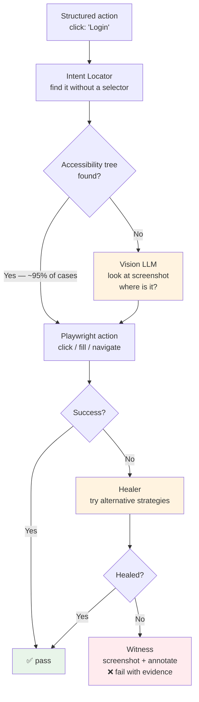
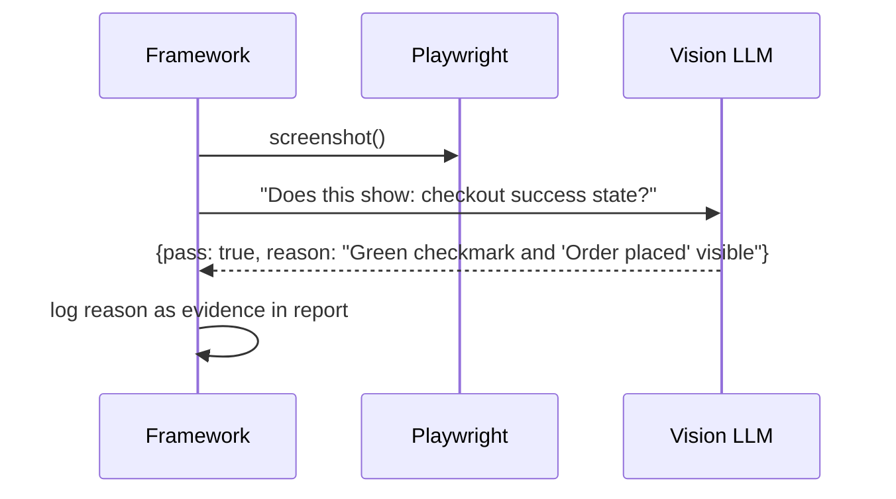
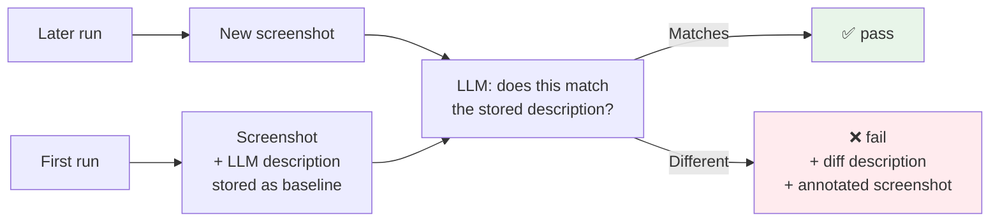

# Phase 2 — Web Agent

**Goal**: Execute web steps using Playwright. Find elements by what they *are*, not where they live in the DOM. Assert using both DOM and vision.

---

## Explain like I'm 5

The web agent is like a person sitting at a computer. You tell them "click the Login button." They look at the screen, find the button that says "Login," and click it. They don't need to know it's called `#auth-submit-btn` in the code — they just read the label like a human would.

---

## Architecture



---

## Intent locator — no selectors, ever

The QA writes `"Login"`. The locator chain tries these in order, stopping at the first hit:

```
1. getByRole('button', { name: 'Login' })       ← accessible name
2. getByLabel('Login')                           ← form label
3. getByText('Login')                            ← visible text
4. getByPlaceholder('Login')                     ← placeholder
5. getByTitle('Login')                           ← title attribute
6. screenshot → vision LLM → "where is Login?"  ← last resort
```

Steps 1–5 are Playwright built-ins. Zero LLM cost. Step 6 only fires if all five fail — which happens on poorly labelled legacy UIs or canvas-rendered elements.

```python
async def locate(page, locator_text: str):
    strategies = [
        page.get_by_role("button", name=locator_text),
        page.get_by_label(locator_text),
        page.get_by_text(locator_text),
        page.get_by_placeholder(locator_text),
        page.get_by_title(locator_text),
    ]
    for strategy in strategies:
        if await strategy.count() > 0:
            return strategy
    return await vision_locate(page, locator_text)  # step 6
```

---

## Step types

### Navigate

```gherkin
Given I am on the login page
When I go to checkout
Given I open the homepage
```

The LLM resolves the destination from the page name ("checkout" → known URL from session history or site map). If the framework has never seen the page, it looks for a link or button with that text and clicks it.

### Fill

```gherkin
And I enter [my email] in the email field
And I type [my password] in the password box
And I fill in the card number with [my card]
```

Resolves "email field" via intent locator → `page.fill(locator, value)`.

### Click

```gherkin
When I click "Proceed to Checkout"
When I press the Login button
When I tap Submit
```

"click", "press", "tap" are all synonyms — pattern matching normalises them.

### Select / Check

```gherkin
When I select "Express Shipping" from the delivery options
When I check the "Accept Terms" checkbox
```

### Wait

```gherkin
And I wait for the page to load
And I wait until "Order Summary" is visible
```

Uses `page.wait_for_selector` with the intent locator chain. Timeout from `BDDFRAME_TIMEOUT` env var (default 30s).

---

## Assertions

### Structural (DOM — fast, deterministic)

```gherkin
Then I should see "Thank you for your order"
Then I should not see "Error"
Then the page title should contain "Dashboard"
Then the url should include "/dashboard"
```

These never touch the LLM. Direct DOM/Playwright calls.

### Semantic (vision LLM — for things you can't express in DOM)

```gherkin
Then the checkout form should show a success state
Then the user's name should appear in the header
Then the chart should display an upward trend
```

Flow: screenshot → vision LLM prompt `"Does this screen show: {assertion}? Answer yes or no and explain."` → pass/fail + reason logged.



The LLM's reason is stored in the Allure report — the QA can read *why* it passed or failed, not just that it did.

### Visual baseline

```gherkin
And the screen should look the same as before
And the screen should look the same as before ignoring the header
```

**First run**: captures screenshot, sends to vision LLM, stores a *semantic description* of the page (not a pixel image). e.g. `"Blue checkout form. Order summary on the right. Two items listed. Green Place Order button at bottom."`

**Subsequent runs**: captures new screenshot, asks vision LLM `"Does this match this description? What's different?"` Returns pass/fail + diff description.

This tolerates timestamps, avatars, dynamic badges — things that change every run but don't represent a regression.



---

## Self-healing

When all locator strategies fail:

1. Re-scan the DOM — page may still be loading
2. Scroll the viewport — element may be off-screen
3. Try partial text match — "Proceed to Checkout" → "Checkout"
4. Ask LLM with full DOM context — generate a CSS selector as last resort

On a successful heal: log a **healing event** in the report with what failed and what worked. CI can be configured to treat healing events as warnings (not failures) — gives teams visibility into UI drift without breaking the pipeline immediately.

---

## Browser configuration via tags

| Tag | Effect |
|-----|--------|
| `@web` | Chromium (default) |
| `@web @firefox` | Firefox |
| `@web @webkit` | Safari engine |
| `@headless` | No visible browser window |
| `@web @mobile @iphone` | Playwright iPhone emulation |
| `@web @mobile @android` | Playwright Android emulation |
| `@record_video` | Record `.webm`, attach to report |
| `@slow` | 500ms delay between actions (debug aid) |

---

## Deliverables

- [ ] `bddframe/agents/web/driver.py` — Playwright session manager
- [ ] `bddframe/agents/web/locator.py` — intent locator chain (steps 1–5)
- [ ] `bddframe/agents/web/vision_locate.py` — step 6 vision LLM fallback
- [ ] `bddframe/agents/web/actions.py` — click, fill, navigate, select, wait
- [ ] `bddframe/agents/web/assertions.py` — structural + semantic + baseline
- [ ] `bddframe/agents/web/healer.py` — self-healing strategies
- [ ] `bddframe/resolver/web_patterns.py` — tier-1 patterns for all web steps
