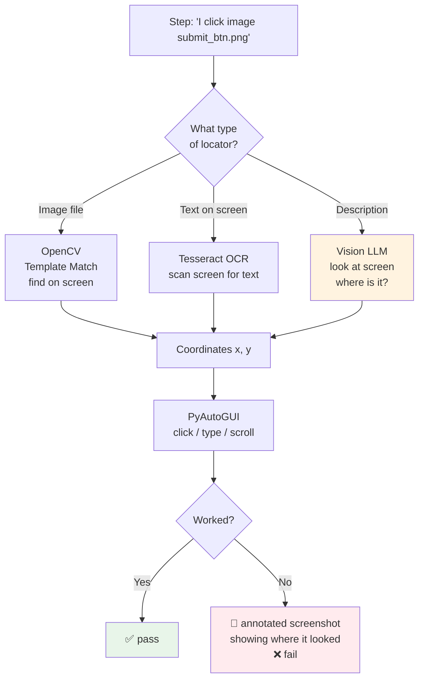
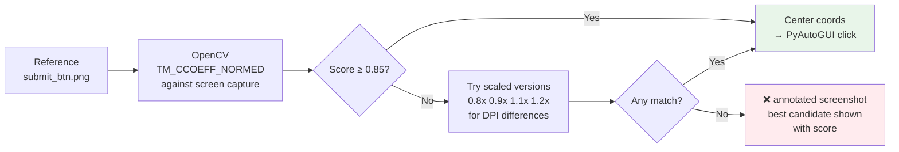

# Phase 3 — Visual / Desktop Agent

**Goal**: Automate anything on screen that isn't a browser DOM — desktop apps, Electron apps, Citrix, legacy software, anything a human eye can see.

---

## Explain like I'm 5

The web agent reads the page's code to find buttons. The visual agent just looks at a picture of the screen — like a human — and finds the button by what it *looks like*. If you show it a photo of the Submit button and say "click this", it scans the screen, finds the matching image, and clicks it.

---

## Architecture



---

## When to use this agent vs web agent

| Situation | Agent |
|-----------|-------|
| Modern web app (HTML DOM accessible) | Web agent (Playwright) |
| Legacy web app rendered in frames / Flash | Visual agent |
| Desktop app (Electron, native Windows/Mac) | Visual agent |
| Citrix / remote desktop / VDI | Visual agent |
| Web app + desktop notification interaction | Both, in the same scenario |

Tag `@visual` on a scenario to activate this agent. Both agents can be active in the same scenario — the orchestrator picks the right one per step.

---

## Locator type 1: image matching (Sikuli-style)

QA stores a reference screenshot of the target element in `tests/assets/`:

```
tests/
  assets/
    submit_btn.png
    close_icon.png
  checkout.feature
```

Step:
```gherkin
When I click image "submit_btn.png"
When I click image "submit_btn.png" with confidence 0.75
```

OpenCV `matchTemplate` scans the full screen for the reference image:



Scaling handles DPI differences between the QA's Mac and a 4K CI agent monitor.

---

## Locator type 2: text on screen (OCR)

```gherkin
When I click text "Submit Order" on screen
Then I should see text "Order Confirmed" on screen
```

`pytesseract` wraps Tesseract. Screenshot is pre-processed (grayscale, contrast boost) before OCR to improve accuracy on UI text. Returns word bounding boxes — centroid used as click target.

Best for: menus, dialogs, tooltips, non-interactive labels, legacy apps with no accessible DOM.

---

## Locator type 3: description (vision LLM fallback)

```gherkin
When I click "the blue Submit button in the bottom right corner"
```

No image file. No text search. Framework takes a screenshot, sends it to the vision LLM with the description, gets back coordinates.

```python
# ponytail: only fires when types 1 and 2 fail or no image is provided
response = ask_vision(
    image=screenshot,
    prompt=f'In this screenshot, where is: "{description}"? Reply with {{"x": int, "y": int}} only.'
)
```

**Requires** `BDDFRAME_VISION_MODEL` to be set. Disabled by default — keeps CI costs zero when not needed.

---

## Built-in step patterns

```
When I click image {image_file}
When I click image {image_file} with confidence {threshold}
When I click text {text} on screen
When I right-click image {image_file}
When I double-click image {image_file}
When I type {text}
When I press key {key}
When I drag {image_file} to {target_image_file}
When I scroll down {n} times
When I scroll up {n} times
When I scroll to image {image_file}
Then I should see image {image_file} on screen
Then I should see text {text} on screen
Then I should not see image {image_file} on screen
And I wait until image {image_file} appears
And I wait until image {image_file} disappears
And I wait until text {text} appears on screen
And I focus on screen region {region}
```

Regions: `top-left`, `top-right`, `bottom-left`, `bottom-right`, `center`, or `x,y,width,height`.

---

## Failure evidence

On failed image match, the annotated screenshot shows:

- **Blue dashed box**: region searched
- **Orange box**: best candidate found (even if below threshold) with confidence score
- **Red label**: what was expected, what was found

Gives the QA enough information to decide: "the image needs updating" vs "the feature is genuinely broken."

---

## Azure DevOps / headless CI

Visual agent requires a display. On Linux CI agents:

```yaml
# azure-pipelines.yml
- script: |
    export DISPLAY=:99
    Xvfb :99 -screen 0 1920x1080x24 &
    bddframe run tests/ --tag visual
  displayName: Run visual tests
```

On Windows Azure agents: works natively (GUI session available in hosted agents).

---

## Mixed scenario example

Web agent and visual agent in the same scenario:

```gherkin
@web @visual
Scenario: Upload document via file picker dialog

  Given I am on the documents page
  When I click "Upload Document"
  # web agent handles above — Playwright

  Then I wait until image "file_picker_dialog.png" appears
  And I click image "browse_button.png"
  And I type [my file path]
  And I press key "Enter"
  # visual agent handles above — OpenCV + PyAutoGUI

  Then I should see "Upload complete" on the page
  # web agent resumes
```

The orchestrator switches agents mid-scenario based on which step patterns match.

---

## Deliverables

- [ ] `bddframe/agents/visual/matcher.py` — OpenCV template match + scale variants
- [ ] `bddframe/agents/visual/ocr.py` — pytesseract wrapper with preprocessing
- [ ] `bddframe/agents/visual/vision_locate.py` — vision LLM coordinate fallback
- [ ] `bddframe/agents/visual/desktop.py` — PyAutoGUI actions
- [ ] `bddframe/agents/visual/screenshot.py` — full-screen capture
- [ ] `bddframe/resolver/visual_patterns.py` — tier-1 patterns for all visual steps
- [ ] `tests/assets/` convention documented
