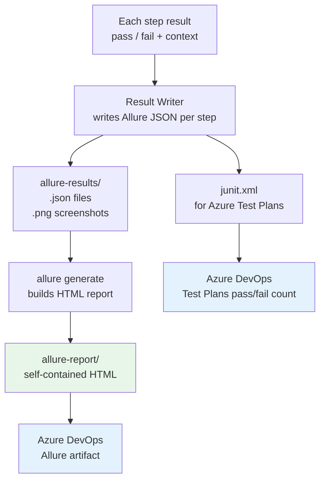
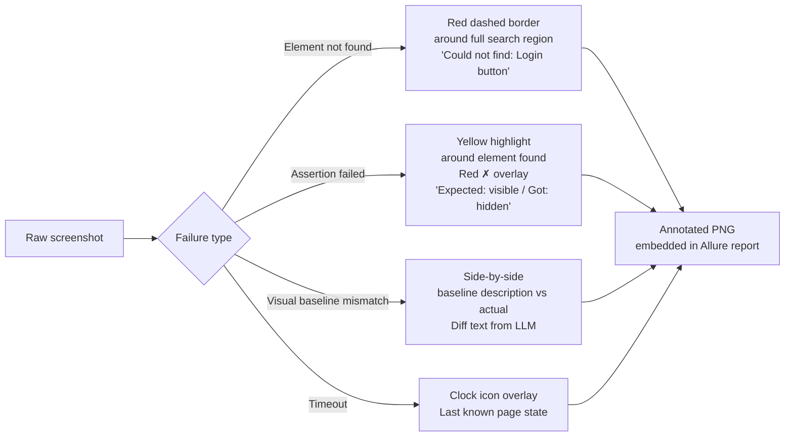
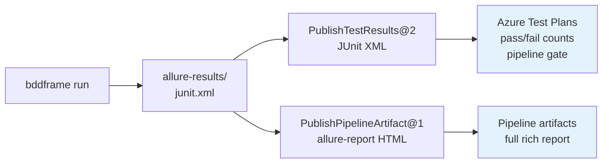

# Phase 5 — Reporting

**Goal**: After every run, produce a report that shows what happened, where it failed, and a screenshot with the failure point circled — all in a format Azure DevOps understands natively.

---

## Explain like I'm 5

After the tests run, the framework writes a report card. For every test that failed, it shows a photo of the screen at the moment it broke, with a red box drawn around the exact spot that caused the problem. Anyone — developer, manager, QA — can look at the report and instantly understand what went wrong without needing to re-run anything.

---

## Architecture



---

## What the report shows per scenario

| Section | Content |
|---------|---------|
| Scenario name | From the `.feature` file |
| Feature name | From the `.feature` file |
| Tags | `@smoke`, `@web`, custom tags |
| Status | Passed / Failed / Flaky (passed on retry) |
| Duration | Per step and total |
| Step list | Each step highlighted pass/fail |
| Failed step detail | Error message + annotated screenshot |
| LLM calls | Count, model, which steps triggered LLM |
| Healing events | Which steps self-healed and how |
| Semantic assertion reasoning | The LLM's explanation for pass/fail |
| Browser / OS | Captured from Playwright session |

---

## Screenshot annotation

Every failing step gets a screenshot. The annotation depends on what failed:



Annotation is done with `Pillow` — no additional dependencies.

```python
# bddframe/reporting/annotate.py
from PIL import Image, ImageDraw, ImageFont

def draw_not_found(img_path: str, region: dict, label: str) -> str:
    img = Image.open(img_path)
    draw = ImageDraw.Draw(img)
    draw.rectangle([region["x"], region["y"],
                    region["x"] + region["w"], region["y"] + region["h"]],
                   outline="red", width=3)
    draw.text((region["x"], region["y"] - 20), label, fill="red")
    out = img_path.replace(".png", "_annotated.png")
    img.save(out)
    return out
```

---

## Allure result structure

One JSON file per scenario, one PNG per failing step:

```
allure-results/
  abc123-result.json        ← scenario result
  abc123-attach-1.png       ← step 3 screenshot (annotated)
  abc123-attach-2.png       ← step 5 screenshot (annotated)
  def456-result.json
```

Each step inside the result JSON:

```json
{
  "name": "And I enter [my email] in the email field",
  "status": "passed",
  "start": 1719000001000,
  "stop": 1719000002300
}
```

Failed step:

```json
{
  "name": "Then I should see a thank you message",
  "status": "failed",
  "statusDetails": {
    "message": "Text 'Thank you for your order' not found on page",
    "trace": "URL: https://shop.com/checkout\nPage title: Error — Payment declined"
  },
  "attachments": [{
    "name": "failure_screenshot",
    "source": "abc123-attach-1.png",
    "type": "image/png"
  }],
  "parameters": [
    { "name": "resolved_locator", "value": "text='Thank you for your order'" },
    { "name": "strategy_used", "value": "getByText (tier 1)" }
  ]
}
```

---

## Semantic assertion evidence

When a vision LLM assertion runs, its reasoning is attached:

```json
{
  "name": "Then the checkout form should show a success state",
  "status": "passed",
  "attachments": [
    { "name": "screenshot", "source": "...", "type": "image/png" },
    { "name": "llm_reasoning", "source": "...", "type": "text/plain" }
  ]
}
```

`llm_reasoning.txt` content: `"Green checkmark visible. 'Order placed successfully' heading present. Order number #4821 shown. No error indicators."`

QAs and developers can read this without understanding selectors or DOM.

---

## Flaky test tracking

With `@retry(3)`:

- Pass on first try → **Passed**
- Fail first, pass second try → **Flaky** (yellow in Allure)
- Fail all retries → **Failed**

Allure's trend chart shows flaky rate over time — a rising flaky count is an early signal of unstable application behaviour.

---

## JUnit XML (Azure Test Plans)

Generated alongside Allure. Required for Azure DevOps to show pass/fail counts in the pipeline summary without any plugin:

```xml
<testsuite name="Guest Checkout" tests="3" failures="1" time="14.2">
  <testcase name="Customer completes a purchase" classname="checkout.feature" time="9.1"/>
  <testcase name="Payment is declined gracefully" classname="checkout.feature" time="5.1">
    <failure message="Text 'Payment declined' not found">
      URL: https://shop.com/checkout
      Step: Then I should see a payment declined message
    </failure>
  </testcase>
</testsuite>
```

---

## Azure DevOps integration



Pipeline tasks (full YAML in Phase 6):

```yaml
- task: PublishTestResults@2
  condition: always()
  inputs:
    testResultsFormat: JUnit
    testResultsFiles: allure-results/junit.xml
    testRunTitle: BDDFrame — $(Build.SourceBranchName)

- task: PublishPipelineArtifact@1
  condition: always()
  inputs:
    targetPath: allure-report
    artifact: TestReport
```

`condition: always()` ensures the report is published even when tests fail — which is exactly when you need it most.

---

## Deliverables

- [ ] `bddframe/reporting/writer.py` — writes Allure JSON per step as it runs
- [ ] `bddframe/reporting/annotate.py` — Pillow screenshot annotation
- [ ] `bddframe/reporting/junit.py` — JUnit XML from collected results
- [ ] `bddframe/reporting/builder.py` — runs `allure generate` after the suite
- [ ] Flaky detection logic in the retry handler
- [ ] LLM reasoning attached as text file per semantic assertion
