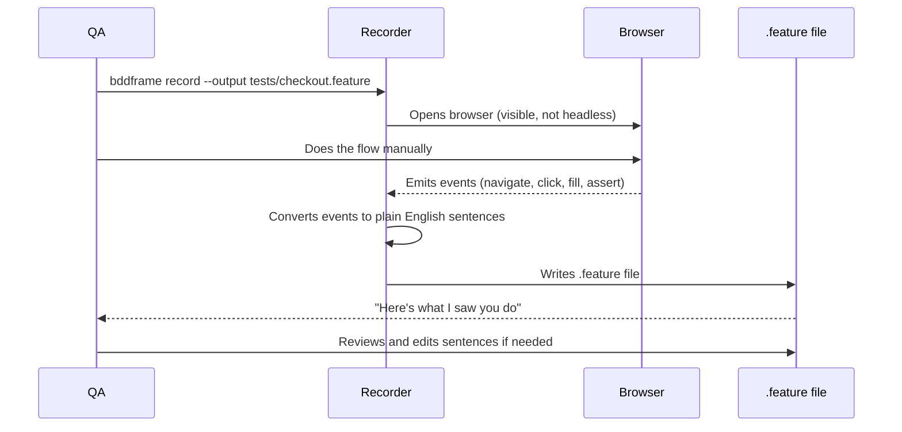
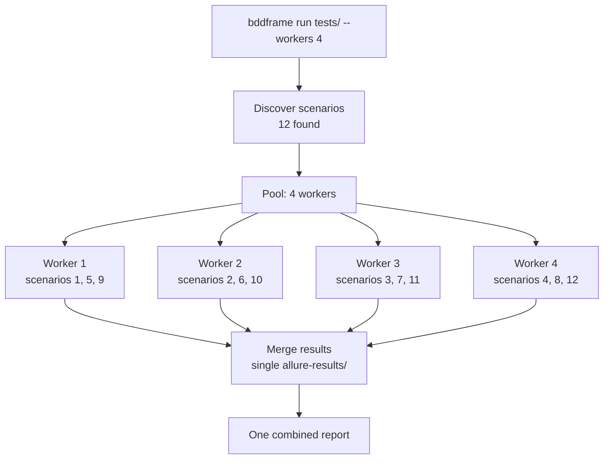

# Phase 6 — CLI, Recorder & Azure DevOps

**Goal**: One command to run tests. One command to record a new test. Drop-in pipeline YAML for Azure DevOps.

---

## Explain like I'm 5

The CLI is like a remote control. You press one button and the tests run. You press another button and it watches you do something in a browser and writes the test for you automatically. In Azure DevOps, you paste a few lines into your pipeline file and it all runs on the build server the same way.

---

## The recorder — how tests get created without writing

The recorder is the answer to "I don't know what URL to put" and "I don't know what to write."



What the recorder captures and converts:

| Browser event | Generated step |
|--------------|----------------|
| `navigate → /cart` | `Given I am on the cart page` |
| `click #checkout-btn` | `When I click "Proceed to Checkout"` |
| `fill #email ← test@x.com` | `And I enter [MY_EMAIL] in the email field` |
| `fill #card ← 4111...` | `And I enter [MY_CARD] in the card number field` |
| `click #place-order` | `And I click "Place Order"` |
| `page contains "Thank you"` | `Then I should see "Thank you for your order"` |

The recorder uses Playwright's `page.on('request')`, `page.on('framenavigated')`, and accessibility snapshots to generate human-readable steps — not raw selectors.

Sensitive values (emails, card numbers, passwords) are automatically detected and replaced with `[VARIABLE_NAME]` placeholders. The actual values go into `.env`.

---

## CLI commands

```bash
# Record a new test (opens a browser, watch what you do)
bddframe record --output tests/checkout.feature

# Run a single feature file
bddframe run tests/checkout.feature

# Run all feature files in a folder
bddframe run tests/

# Run only scenarios tagged @smoke
bddframe run tests/ --tag smoke

# Run in headless mode (no visible browser)
bddframe run tests/ --headless

# Run with 4 parallel workers
bddframe run tests/ --workers 4

# Override the LLM model
bddframe run tests/ --model ollama/llama3

# Validate .feature files without running (syntax + variable check)
bddframe validate tests/

# List all discovered scenarios
bddframe list tests/

# Open the last report in browser
bddframe report open

# Force a fresh visual baseline (re-captures all baselines)
bddframe run tests/ --reset-baselines
```

---

## Parallel execution



Each worker gets its own browser session. Results are merged into a single `allure-results/` folder at the end. Uses `multiprocessing.Pool` — no extra dependency.

---

## Environment variables

| Variable | Default | Description |
|----------|---------|-------------|
| `BDDFRAME_MODEL` | `ollama/llama3` | LLM for step resolution |
| `BDDFRAME_VISION_MODEL` | *(unset)* | Vision LLM for semantic assertions |
| `BDDFRAME_LLM_URL` | `http://localhost:11434` | Ollama or any OpenAI-compatible endpoint |
| `BDDFRAME_HEADLESS` | `false` | Force headless browser |
| `BDDFRAME_WORKERS` | `1` | Parallel scenario count |
| `BDDFRAME_TIMEOUT` | `30` | Default element wait timeout (seconds) |
| `BDDFRAME_CONFIDENCE` | `0.85` | OpenCV template match threshold |
| `BASE_URL` | *(required)* | App base URL — used by recorder and navigate steps |

Any `[variable]` used in a `.feature` file maps to an env var of the same name uppercased with spaces replaced by underscores.

---

## Azure DevOps pipeline — Linux agent

```yaml
# azure-pipelines.yml
trigger:
  - main
  - develop

pool:
  vmImage: ubuntu-latest

variables:
  - group: bddframe-secrets   # BASE_URL, MY_EMAIL, MY_CARD, BDDFRAME_LLM_URL

steps:
  - task: UsePythonVersion@0
    inputs:
      versionSpec: '3.11'

  - script: |
      pip install bddframe
      playwright install chromium --with-deps
    displayName: Install BDDFrame

  - script: |
      export DISPLAY=:99
      Xvfb :99 -screen 0 1920x1080x24 &
      bddframe run tests/ --headless --workers 2
    displayName: Run tests
    env:
      BASE_URL: $(BASE_URL)
      MY_EMAIL: $(MY_EMAIL)
      MY_CARD: $(MY_CARD)
      BDDFRAME_LLM_URL: $(BDDFRAME_LLM_URL)
      BDDFRAME_MODEL: $(BDDFRAME_MODEL)

  - task: PublishTestResults@2
    condition: always()
    inputs:
      testResultsFormat: JUnit
      testResultsFiles: allure-results/junit.xml
      testRunTitle: BDDFrame — $(Build.SourceBranchName)

  - task: PublishPipelineArtifact@1
    condition: always()
    inputs:
      targetPath: allure-report
      artifact: TestReport
      publishLocation: pipeline
```

---

## Azure DevOps pipeline — Windows agent

```yaml
pool:
  vmImage: windows-latest

steps:
  - task: UsePythonVersion@0
    inputs:
      versionSpec: '3.11'

  - script: |
      pip install bddframe
      playwright install chromium --with-deps
    displayName: Install BDDFrame

  - script: |
      bddframe run tests/ --headless --workers 2
    displayName: Run tests
    env:
      BASE_URL: $(BASE_URL)
      MY_EMAIL: $(MY_EMAIL)
```

No `Xvfb` needed on Windows. Visual agent steps (`@visual`) work natively on Windows hosted agents.

---

## LLM in CI — two options

**Option A: Hosted LLM (recommended for CI)**

```yaml
env:
  BDDFRAME_LLM_URL: https://api.openai.com/v1
  BDDFRAME_MODEL: openai/gpt-4o-mini
  OPENAI_API_KEY: $(OPENAI_API_KEY)
```

Cost per run is minimal — LLM is only called for step tier-2 fallback and semantic assertions, not every step.

**Option B: Ollama in CI (free, slower startup)**

```yaml
- script: |
    curl -fsSL https://ollama.com/install.sh | sh
    ollama serve &
    sleep 5
    ollama pull llama3
  displayName: Start Ollama
```

Adds ~2 minutes to pipeline startup for model pull (cached after first run on a persistent agent).

---

## Exit codes

| Code | Meaning | Pipeline effect |
|------|---------|----------------|
| `0` | All scenarios passed | Pipeline continues |
| `1` | One or more scenarios failed | Pipeline fails, blocks PR |
| `2` | Parse or config error | Pipeline fails |
| `3` | LLM unreachable | Pipeline fails with clear message |

---

## Deliverables

- [ ] `bddframe/cli.py` — all CLI commands via `typer`
- [ ] `bddframe/recorder/recorder.py` — Playwright event capture + `.feature` writer
- [ ] `bddframe/recorder/sensitives.py` — auto-detection of sensitive values → `[VARIABLE]`
- [ ] `azure-pipelines.yml` — Linux template
- [ ] `azure-pipelines-windows.yml` — Windows template
- [ ] `.env.example` — all variables documented
- [ ] `pyproject.toml` — complete with all deps + `bddframe` entry point
