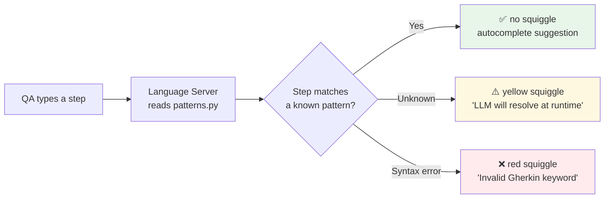
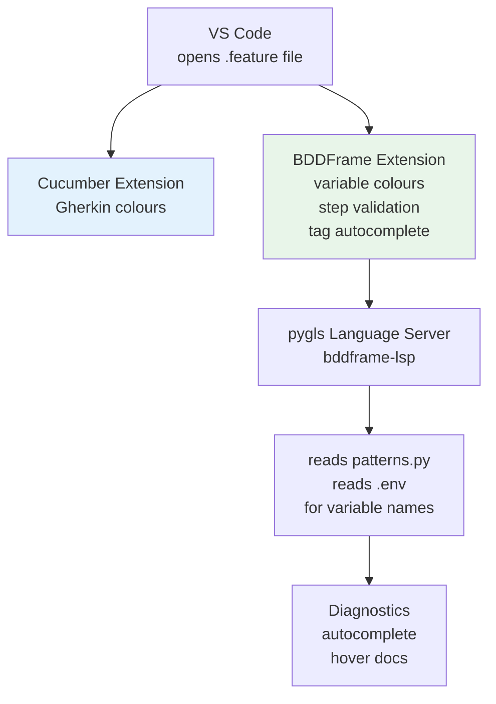

# Phase 6 — Syntax Highlighting & Editor Experience

**Goal**: The `.feature` file looks great in VS Code, `[variables]` are highlighted, `@tags` autocomplete, and unknown steps get a warning before you even run.

---

## Explain like I'm 5

When you write your test, the editor lights up the words in different colours so it's easy to read — action words are one colour, values are another, tags are another. It's like how a word processor underlines spelling mistakes, except this underlines test steps that the framework might not understand.

---

## What already exists for free

Standard Gherkin `.feature` files already have excellent VS Code support via the **Cucumber** extension (`alexkrechik.cucumberautocomplete`). It handles:

- `Feature:`, `Scenario:`, `Given`, `When`, `Then`, `And` — coloured
- `@tags` — coloured
- `"quoted strings"` — coloured
- `# comments` — coloured
- Scenario outline `<parameters>` — coloured

**This means Phase 6 scope is smaller than originally planned.** We extend what exists rather than build from scratch.

---

## What we add on top

Three things the standard Cucumber extension doesn't do:

### 1. `[variable]` highlighting

`[my email]`, `[my card]` are BDDFrame-specific syntax. We add a TextMate grammar injection to colour them distinctly (yellow/gold) so QAs can see at a glance which values come from `.env`.

```json
{
  "scopeName": "injection.bddframe.variables",
  "injectionSelector": "source.feature",
  "patterns": [
    {
      "match": "\\[[^\\]]+\\]",
      "name": "variable.other.bddframe"
    }
  ]
}
```

One grammar file, ~10 lines. Ships as a VS Code extension alongside the Cucumber extension.

### 2. Step validation (LSP)



Unknown steps are **warnings, not errors** — the LLM resolves them at runtime. The QA is informed but not blocked.

Built with `pygls` (MIT) — a Python LSP framework. The server reads `bddframe/resolver/patterns.py` and `bddframe/resolver/web_patterns.py` directly, so the editor always reflects the actual patterns without manual sync.

### 3. Tag and variable autocomplete

Typing `@` suggests all known tags:

```
@web            run with Playwright browser
@visual         run with OpenCV / desktop
@mobile         run with Appium
@headless       no visible browser window (CI)
@smoke          tag for fast subset runs
@retry(n)       retry flaky scenario n times
@record_video   capture video of the run
@baseline       force a new visual baseline
```

Typing `[` suggests all variable names found in `.env` in the current project.

---

## Architecture



---

## Installation

**From VS Code marketplace** (normal):
```
ext install bddframe.bddframe-vscode
```

**Air-gapped enterprise** (no internet access):
```bash
# download the .vsix from the release artifacts
code --install-extension bddframe-0.1.0.vsix
```

The Cucumber extension (`alexkrechik.cucumberautocomplete`) is a peer dependency — the BDDFrame extension installs it automatically if missing.

---

## What the QA sees

```gherkin
Feature: Guest Checkout                                  ← blue bold

  @web @smoke                                            ← orange tags
  Scenario: Customer completes a purchase                ← blue bold

    Given I have 2 items in my cart                      ← purple Given, white step
    When I go to checkout                                 ← purple When
    And I enter [my email] in the email field             ← [my email] gold
    And I enter [my card number] in the card details      ← [my card number] gold
    And I place the order
    Then I should see a thank you message
    And the screen should look the same as before         ← ⚠️ yellow — LLM will resolve
```

The yellow warning on the last step tells the QA: "I don't have a built-in pattern for this — the LLM will handle it at runtime." They can run it or add it to the pattern list if it becomes common.

---

## Deliverables

- [ ] `vscode-extension/` — VS Code extension package
- [ ] `vscode-extension/syntaxes/bddframe-variables.json` — TextMate injection grammar
- [ ] `bddframe/lsp/server.py` — pygls language server
- [ ] `vscode-extension/package.json` — extension manifest, declares `bddframe-lsp` as the language server
- [ ] `.vsix` build via `vsce package` in `Makefile`
- [ ] `bddframe-lsp` registered as a console script in `pyproject.toml`
