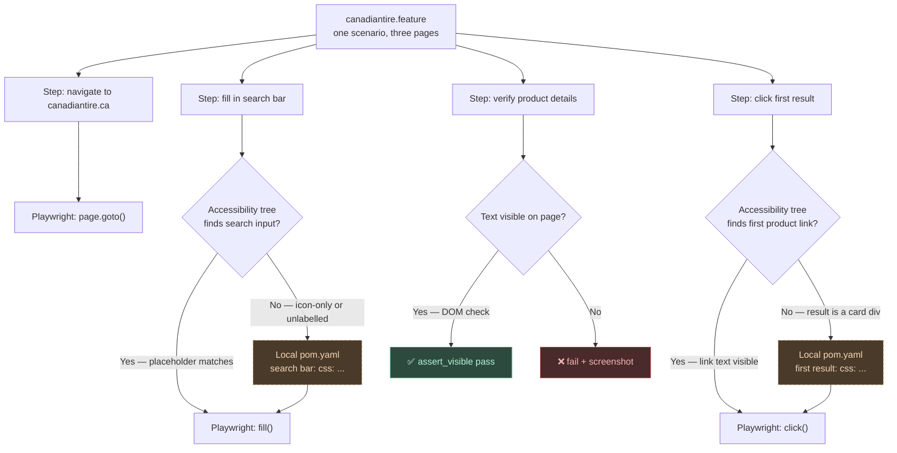

# Phase 8 — Test Development Guide: Feature Files & POM Authoring

**Goal**: Explain how a QA writes `.feature` files, when (and when not) to write a local `pom.yaml`, and how the two relate when a scenario spans multiple pages.

---

## Is the multi-page scenario a problem?

**No.** The framework is stateless about pages — there is no concept of "which page am I on." The agent just acts on whatever is in the browser at the time each step runs. A scenario can navigate from a home page to a search results page to a product detail page without any special configuration. The feature file reads top to bottom; the browser follows.

The only time a tester needs to do extra work is when the agent **cannot find an element by its natural label** — and that is where `pom.yaml` enters.

---

## Resolution ladder (what happens when a step runs)

Every step that targets an element goes through this chain, stopping at the first hit:

```
1. Accessibility tree
   getByRole / getByLabel / getByPlaceholder / getByTitle / getByText

2. Self-heal: scroll + retry

3. Self-heal: partial text match (first word)

4. POM YAML lookup
   local pom.yaml (features/<subfolder>/pom.yaml) checked first
   global pom.yaml (features/pom.yaml) checked second

5. Vision LLM (screenshot → ask the model where the element is)
```

Steps 1–3 are pure Playwright — no LLM, no config, zero cost.
Step 4 (POM) only fires if 1–3 all fail.
Step 5 only fires if 4 also fails and `BDDFRAME_MODEL` is set.

**Rule of thumb**: write the step first, run it, watch what happens. Only add a POM entry when you see `📋 POM:` or `🔧 Healed:` printed and it still fails.

---

## Feature file — authoring rules

### One feature per page or flow

Group related scenarios together. A multi-page flow (home → search → product) lives in **one** `.feature` file because it is one user journey.

### Steps are plain sentences

Write what a human would say, not what the DOM looks like. The resolver matches patterns; the agent finds the element.

```gherkin
# Good — describes the intent
When User fills in "mastercraft tool box" in the search bar
And User clicks the first result
Then User should see "MASTERCRAFT"

# Avoid — describes the DOM
When User fills in "mastercraft tool box" in "input[data-testid='search-input']"
```

### Env variables for secrets

Wrap any credential or environment-specific value in `[BRACKETS]`:

```gherkin
When User enters [SAUCE_USERNAME] in the username field
```

The framework reads these from `.env` at runtime.

---

## Local POM YAML — when to write it

### Write a POM entry when:

| Symptom | Why POM helps |
|---------|---------------|
| Element has no accessible text, label, or role | Agent can't find what it can't read |
| The label in the step doesn't match any visible text on screen | Name mismatch — map it explicitly |
| An icon-only button (no text, no aria-label) | No natural handle — needs a CSS or testid selector |
| A custom web component that hides its internals | Accessibility tree is shallow — direct selector needed |
| The agent keeps picking the wrong element (ambiguous label) | Explicit selector wins over partial match |

### Do NOT write a POM entry when:

- The step already passes (agent found the element in steps 1–3)
- The element has visible text that matches the step
- An `aria-label` or `placeholder` attribute exactly describes the element

---

## POM YAML structure

A `pom.yaml` file is a flat key → selector mapping. The key is the human label used in the step. The selector is what Playwright uses.

```yaml
# Supported selector types: css | xpath | id | testid | text | role

search bar:
  css: "input[data-testid='search-input']"

first result:
  css: ".product-tile:first-of-type a"

product title:
  testid: "product-name"

cookie accept button:
  id: "onetrust-accept-btn-handler"
```

Key matching is **case-insensitive and whitespace-normalised**. `"Search Bar"`, `"search bar"`, and `"search  bar"` all map to the same entry.

---

## POM scope: local vs global

| File | Scope | When to use |
|------|-------|-------------|
| `features/<subfolder>/pom.yaml` | Only for `.feature` files in that subfolder | Site-specific elements that won't appear elsewhere |
| `features/pom.yaml` | All feature files across the project | Shared elements: cookie banners, nav menus, headers |

The local POM is checked first. If the same key exists in both, the local entry wins.

**For multi-page flows**: you do NOT need a separate `pom.yaml` per page. One local `pom.yaml` covers all pages visited by any scenario in that folder. Organise it with comments per page for readability.

---

## The full picture for a multi-page flow



---

## Step reference — web actions

| Intent | Example step |
|--------|-------------|
| Navigate | `Given User is on "https://example.com"` |
| Fill field | `When User fills in "value" in the search bar` |
| Click element | `When User clicks the login button` |
| Click by text | `When User clicks "Add to Cart"` |
| Wait for load | `And User wait for the page to load` |
| Assert visible | `Then User should see "Product Name"` |
| Assert hidden | `Then User should not see "Error"` |
| Assert URL | `And User should have url containing "/search"` |
| Assert title | `And the page title should contain "Canadian Tire"` |

---

## Tags reference

| Tag | Effect |
|-----|--------|
| `@web` | Run with Playwright (Chromium by default) |
| `@headless` | No visible browser window |
| `@smoke` | Smoke-test subset — run with `--tags @smoke` |
| `@firefox` / `@webkit` | Override browser engine |
| `@slow` | 500 ms delay between actions (debug aid) |
