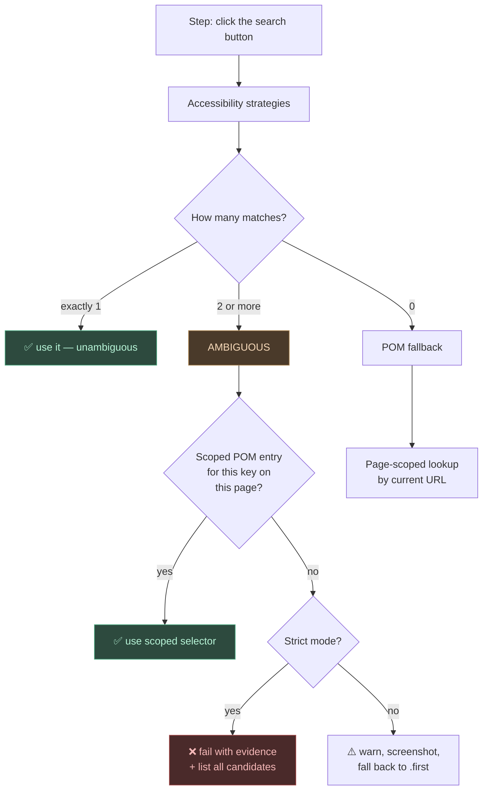

# Phase 9 — Correct-Element Resolution (Disambiguation Plan)

**Goal**: Guarantee the framework interacts with the *intended* element, not
just the first one that happens to match. Eliminate silent wrong-element
selection across both the accessibility path and the POM fallback.

> Status: **Plan only — not yet implemented.** This document divides the work
> into independently shippable phases.

---

## The actual problem (where the bug lives)

There are two distinct failure modes, and they happen in two different places.

### Failure A — silent `.first` on the accessibility path

`locator.py:_try_strategies` returns the first match the moment any strategy
finds *something*:

```python
if loc.count() > 0:
    return loc.first          # ← picks element 1 of N, blindly
```

If a page has two "Search" buttons (header + sidebar), `get_by_role("button",
name="search")` returns **both**. The framework takes `.first` and may click
the wrong one. **No warning. No screenshot. The test may even pass for the
wrong reason.**

This is the dominant failure mode — and critically, the POM is *never
consulted* here, because a match was "found." So a page-scoped POM alone
cannot fix it.

### Failure B — page-blind POM fallback

`pom.py:_lookup` is a flat scan with no URL context. A key written for the home
page fires on the results page, and YAML silently drops duplicate keys.
(Documented in [pom-key-mapping.md](pom-key-mapping.md#the-page-blindness-problem).)

---

## Design principle check

The framework's contract (docs/README.md) is: *the `.feature` file is the QA
artifact; sentences over syntax; accessibility before LLM.* Any fix must:

- **Not** force XPath or selectors into the feature file.
- Keep the default authoring experience as plain sentences.
- Make disambiguation **explicit and opt-in**, only paid for when needed.
- Be backward compatible — existing flat `pom.yaml` files keep working.

This rules out "always require a page name in every step." It points toward:
**detect ambiguity automatically, resolve it from scoped POM, and only ask the
tester for help when the framework genuinely cannot decide.**

---

## Strategy overview



---

## Phase 9.1 — Stop guessing: ambiguity detection (the linchpin)

**Smallest change, highest value. No schema or Gherkin change.**

Rewrite `_try_strategies` so it distinguishes *unique* from *ambiguous*:

1. **Prefer a unique match.** Scan strategies; if one yields exactly one
   element, return it — that is unambiguous and safe.
2. **On ambiguity** (best available match has `count > 1`):
   - Consult the POM for a scoped entry for this key *before* taking `.first`.
     This promotes POM above blind `.first` — the key behavioral inversion.
   - If POM has no entry: behavior depends on mode (below).

**Two modes**, controlled by `BDDFRAME_STRICT_LOCATOR` env var (or `@strict`
tag):

| Mode | On unresolved ambiguity |
|------|-------------------------|
| Lenient (default) | Warn, save annotated screenshot showing all candidates, fall back to `.first`. Test continues — backward compatible. |
| Strict | Fail the step with evidence: the label, the count, and a list of each candidate's text/role/bounding-box, plus the POM key the tester should add. |

**Why default lenient**: flipping every existing suite to hard-fail overnight
is hostile. Lenient surfaces the problem (warning + screenshot) without
breaking green pipelines; teams opt into strict when ready.

**Files**: `locator.py` (`_try_strategies`, `find`), `hooks.py` (read tag/env),
`reporting/annotate.py` (draw candidate boxes).

**Acceptance**: a page with two "Search" buttons + no POM entry →
lenient logs a warning and screenshots both; strict fails listing both
candidates. With a POM entry → uses the scoped selector in both modes.

---

## Phase 9.2 — Page-scoped POM via URL (fix Failure B)

Give the POM a notion of "current page," derived from the URL the browser is
already on. `pom.locate(page, text)` **already receives `page`** — so
`page.url` is available with no signature change.

**New optional YAML structure** (backward compatible):

```yaml
# Page blocks — matched against the live URL, top to bottom, first hit wins
pages:
  home:
    match: { url_contains: "canadiantire.ca/$" }   # regex
    search:  { css: "input.home-search" }

  search results:
    match: { url_contains: "/search" }
    search:  { css: "input.results-filter" }
    first result: { css: ".product-tile:first-of-type a" }

# Page-agnostic — checked after the active page block
shared:
  cookie accept: { id: onetrust-accept-btn-handler }
```

**Lookup order** (in `_lookup`, now taking the URL):

1. Active page block (first `pages:` entry whose `match` fits `page.url`)
2. `shared:` block
3. Legacy top-level flat keys (existing files — unchanged behavior)
4. Global `features/pom.yaml` (same precedence rules)

**Backward compatibility**: a `pom.yaml` with no `pages:` / `shared:` keys is
treated entirely as legacy flat keys. Existing suites need zero changes.

**Duplicate-key safety**: same key under two *different* page blocks is now
legal and correct — they no longer collide, because only the active page's
block is consulted.

**Files**: `pom.py` (`_lookup`, `_build_locator` plumbing for the URL;
`_load_pom_chain` stays). Add a small `test_pom_page_scope.py`.

**Acceptance**: same key `search` resolves to different selectors on `/` vs
`/search`, selected purely by URL. A legacy flat `pom.yaml` behaves exactly as
before.

---

## Phase 9.3 — Explicit page pinning for SPAs (escape hatch)

URL-based scoping fails when the URL doesn't change between logical pages
(single-page apps, modal flows). Provide an **opt-in override** that pins the
active page name regardless of URL.

Two surfaces, pick the lighter one in implementation:

```gherkin
# Option A — a step (reads naturally, scoped to one scenario point)
Given User is on the "Search Results" page

# Option B — a tag (scoped to whole scenario/feature)
@page:search-results
```

Either sets `context._active_page`, which `_lookup` checks **before** URL
matching. The page name maps to the `pages:` block key.

This stays out of the way: only suites with URL-ambiguous SPAs ever write it.

**Files**: `patterns.py` (one navigate-style pattern → `set_page` action),
`actions.py` (`set_page`), `hooks.py` (tag → context), `pom.py` (honor
`_active_page` override).

**Acceptance**: on an SPA where `/app` never changes, `Given User is on the
"Cart" page` makes `search` resolve to the cart block's selector.

---

## Phase 9.4 — (Stretch / YAGNI) split POM into per-page files

Only if a real suite's single `pom.yaml` becomes unwieldy. Allow
`features/<folder>/pages/<page>.yaml`, filename → page-block name. Pure
organizational sugar over 9.2 — **do not build until a suite actually hurts.**
`# ponytail: deferred — one file is fine until it isn't.`

---

## Sequencing & rationale

| Phase | Fixes | Gherkin change | Schema change | Ship independently? |
|-------|-------|----------------|---------------|---------------------|
| 9.1 Ambiguity detection | Failure A (the common one) | none | none | ✅ |
| 9.2 URL page-scoped POM | Failure B | none | additive, opt-in | ✅ |
| 9.3 Explicit page pin | SPA gap in 9.2 | opt-in step/tag | none | ✅ (needs 9.2) |
| 9.4 Per-page files | organization | none | none | deferred |

**Do 9.1 first** — it is the linchpin. Most wrong-element bugs are
ambiguous-but-found cases that never reach the POM today; until the locator
stops silently taking `.first`, the page-scoped POM in 9.2 is unreachable for
those cases. 9.1 alone, in strict mode, already converts every silent
wrong-element into a loud, evidenced failure.

---

## Alternatives considered and rejected

- **Container language in Gherkin** (`click the "Login" button in the header`):
  requires building a containment parser and selector synthesis. Heavy, and
  duplicates what a one-line scoped POM entry already does. Rejected on
  ponytail grounds — not until a parser is the only option left.
- **Mandatory page name in every step**: violates "sentences over syntax,"
  punishes the 95% unambiguous case to serve the 5%. Rejected; made opt-in in 9.3.
- **Pixel/positional indexing as the primary fix** (`button[2]`): fragile under
  layout change. Allowed as a last-resort POM selector, never the mechanism.
