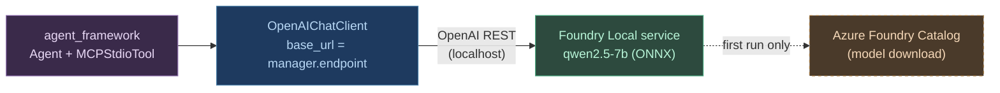

# Phase 10 — Local Agent Framework on a Locked-Down Network (Foundry Local)

**Goal**: Run the Microsoft Agent Framework against a **local** model on a
corporate network where **Hugging Face and Ollama are blocked**, using the
imports already verified to work behind the firewall:

```python
from foundry_local_sdk import Configuration, FoundryLocalManager
from agent_framework import Agent, MCPStdioTool
from agent_framework.openai import OpenAIChatClient
```

Local model: **qwen2.5-7b**. All Python dependency management via **uv**.

> Status: **Plan / Research**. The verdict (below) is confirmed against
> Microsoft docs; the phases are an implementation outline, not yet built.
> Branch: `BFRAME_0009`.

---

## Verdict (the research question, answered first)

**Yes — this stack works on your network, and it works *because* it avoids the
two things that are blocked.** The blocks are irrelevant to Foundry Local:

| Concern | Why it doesn't apply |
|---------|----------------------|
| **Hugging Face blocked** | Foundry Local pulls models from the **Azure-hosted Foundry Catalog**, not Hugging Face. `qwen2.5-7b` is a catalog model, served as an ONNX build. No `huggingface.co` traffic. |
| **Ollama blocked** | Foundry Local is a **separate runtime** — not Ollama, not a wrapper around it. Nothing touches `localhost:11434` or Ollama's registry. |
| **`pip` "has issues" installing the libs** | The Foundry Local **runtime** (the `foundry` service) is **not a pip package** — it installs via `winget`/`brew`. Only the thin Python *SDK* and `agent-framework` go through pip, and those install cleanly via **uv** (see Phase 10.1). Trying to `pip install` the runtime is the likely source of the failures. |

How it fits together: `FoundryLocalManager` starts a local service that exposes
an **OpenAI-compatible REST endpoint**. `OpenAIChatClient` is pointed at that
endpoint — same wire protocol as cloud OpenAI, but everything stays on-device.



Blue/green = entirely local, runs offline once the model is cached. Orange
dashed = the **one** network dependency: the first-run model pull from the
Azure catalog.

### The one risk to confirm

Foundry Local must reach the **Azure Foundry Catalog CDN** once, to download
`qwen2.5-7b`. If your network also blocks that, you fall back to Foundry
Local's **disconnected mode** (model expansion packs / a bring-your-own
ORAS-compatible OCI registry) — covered in Phase 10.4. Test reachability before
committing: `foundry model list` and `foundry model download qwen2.5-7b`.

---

## Lazy check: do you even need the Agent Framework here?

Two distinct use cases hide in this request. Don't build the heavy one for the
light one.

- **Use case A — bddframe's existing LLM fallback** (the `ask`/`ask_vision`
  triggers in [llm.md](llm.md)). bddframe **already** runs on LiteLLM, and
  LiteLLM **already** speaks OpenAI-compatible endpoints. To unblock it on the
  corporate network you need **no new framework at all** — just point it at
  Foundry Local:

  ```bash
  BDDFRAME_MODEL=openai/<foundry-model-id>     # e.g. openai/qwen2.5-7b-instruct-generic-cpu
  BDDFRAME_LLM_URL=http://localhost:<port>/v1  # Foundry Local endpoint
  OPENAI_API_KEY=not-needed                    # local service ignores it
  ```

  `# ponytail: Foundry Local is OpenAI-compatible; LiteLLM already handles it. No agent-framework needed for bddframe's leaf fallback.`

- **Use case B — a new MCP-driven browser agent** (`maf_stdio_browser_app`,
  using `MCPStdioTool`). This *is* genuinely agentic: the model plans, calls
  MCP tools over stdio, loops. bddframe's one-shot `ask()` can't express that.
  **This is where `agent-framework` earns its place.** The phases below build
  *this*.

If your real goal is only A, stop here — you're done with one `.env` change.
The phases assume you want B.

---

## Phase 10.1 — Toolchain & install (uv-first)

The runtime and the Python libs install through **different** channels. This is
the crux of the `pip` failures.

**1. Foundry Local runtime (NOT pip):**

```bash
# Windows (matches azure-pipelines-windows.yml target)
winget install Microsoft.FoundryLocal

# macOS
brew install microsoft/foundrylocal/foundrylocal

# verify
foundry --version
foundry model list          # confirms catalog reachability
```

**2. Python deps via uv** — in a dedicated subproject so the agent app's
dependency tree never collides with bddframe's:

```bash
uv init maf_stdio_browser_app
cd maf_stdio_browser_app
uv add agent-framework foundry-local-sdk
# MCP browser tool over stdio, e.g. Playwright MCP server (run via npx, no pip)
```

**Why a separate uv project**: `agent-framework` drags in a large dependency
set (OpenAI client, MCP, etc.) that bddframe doesn't need. Keeping it out of
the root `pyproject.toml` keeps bddframe's install lean and avoids resolver
conflicts. If you'd rather keep one project, add it as an extra:
`[project.optional-dependencies] agent = ["agent-framework", "foundry-local-sdk"]`.

**Acceptance**: `uv run python -c "from agent_framework import Agent, MCPStdioTool; from agent_framework.openai import OpenAIChatClient; from foundry_local_sdk import FoundryLocalManager; print('ok')"` prints `ok` offline (after install).

---

## Phase 10.2 — Wire Foundry Local to OpenAIChatClient

The manager starts the service, downloads the model on first use, and hands you
the endpoint + a placeholder key. There are two SDK API shapes in the wild —
use whichever your installed `foundry-local-sdk` exposes.

**Convenience API** (matches your import of `Configuration`; what the
agent-framework Foundry samples use):

```python
from foundry_local_sdk import FoundryLocalManager
from agent_framework.openai import OpenAIChatClient

ALIAS = "qwen2.5-7b"

# Starts the local service if needed and ensures the model is downloaded/loaded.
manager = FoundryLocalManager(ALIAS)

chat_client = OpenAIChatClient(
    base_url=manager.endpoint,                       # local OpenAI-compatible URL
    api_key=manager.api_key,                         # placeholder; not validated
    model_id=manager.get_model_info(ALIAS).id,       # resolved catalog model id
)
```

**Explicit API** (current cross-platform SDK, if the convenience properties
aren't present in your version):

```python
from foundry_local_sdk import Configuration, FoundryLocalManager

FoundryLocalManager.initialize(Configuration(app_name="maf_stdio_browser_app"))
manager = FoundryLocalManager.instance
manager.download_and_register_eps()                  # execution providers
model = manager.catalog.get_model("qwen2.5-7b")
model.download(); model.load()
manager.start_web_service()

base_url = f"{manager.urls[0]}/v1"
chat_client = OpenAIChatClient(base_url=base_url, api_key="none", model_id=model.id)
```

**Pin the model id, don't recompute it.** `manager.get_model_info(...).id`
resolves an alias to a hardware-specific build (e.g. `...-cpu` vs `...-gpu`).
Resolve once, log it, reuse it — so a test run isn't silently retargeted to a
different build.

**Acceptance**: a bare `chat_client` round-trip ("say hello") returns text with
the network cable's catalog access *disabled* (model already cached).

---

## Phase 10.3 — The MCP stdio browser agent

Compose the chat client with an MCP browser tool over stdio. The agent plans
and drives the browser through MCP calls; the model never sees raw selectors.

```python
import asyncio
from agent_framework import Agent, MCPStdioTool
from foundry_local_sdk import FoundryLocalManager
from agent_framework.openai import OpenAIChatClient

ALIAS = "qwen2.5-7b"

async def main():
    manager = FoundryLocalManager(ALIAS)
    chat_client = OpenAIChatClient(
        base_url=manager.endpoint,
        api_key=manager.api_key,
        model_id=manager.get_model_info(ALIAS).id,
    )

    # MCP browser server over stdio (Playwright MCP via npx — no pip, no HF).
    browser = MCPStdioTool(
        name="browser",
        command="npx",
        args=["-y", "@playwright/mcp@latest"],
    )

    agent = Agent(
        chat_client=chat_client,
        instructions="You drive a browser via the browser tool to complete QA tasks.",
        tools=[browser],
    )

    result = await agent.run("Open example.com and report the page title.")
    print(result)

asyncio.run(main())

# ponytail: exact Agent(...) kwarg names track the installed agent-framework
# version — confirm against `uv run python -c "import agent_framework; help(...)"`.
```

**Acceptance**: the agent opens a page and returns a fact read from the DOM,
using only the local model and a stdio MCP server — no Ollama, no Hugging Face.

---

## Phase 10.4 — (Contingency / YAGNI) fully disconnected model delivery

Only needed if Phase 10.1's `foundry model list` proves the **catalog CDN is
also blocked**. Don't build this preemptively.

Options, lightest first:

1. **One-time download elsewhere, copy the cache.** Pull `qwen2.5-7b` on a
   machine that can reach the catalog, copy the Foundry Local model cache dir
   onto the locked-down host.
2. **Bring-your-own model** from an internal **ORAS-compatible OCI registry**
   your company already runs.
3. **Model expansion packs** for Foundry Local's disconnected/Azure Local
   deployment.

`# ponytail: deferred — only if the catalog itself is unreachable. Confirm with 10.1 first.`

---

## Sequencing & rationale

| Phase | Delivers | Network need | Status |
|-------|----------|--------------|--------|
| 10.1 Toolchain (uv + winget/brew) | imports resolve, runtime present | catalog reachable (verify) | Plan |
| 10.2 Foundry ↔ OpenAIChatClient | local chat round-trip | first run only | Plan |
| 10.3 MCP stdio browser agent | working agentic browser run | none (offline) | Plan |
| 10.4 Disconnected delivery | model on air-gapped hosts | none | Deferred (contingency) |

**Do 10.1 first and stop to verify catalog reachability** — every later phase
assumes the model can be pulled once. If `foundry model download qwen2.5-7b`
fails, jump to 10.4 before writing any agent code.

---

## Alternatives considered and rejected

- **Self-host Ollama on a different port to dodge the block**: fights IT
  policy, and Foundry Local already solves the local-inference need with a
  Microsoft-sanctioned, OpenAI-compatible runtime. Rejected.
- **Run a model directly from Hugging Face weights via transformers**: blocked
  at the source (HF), and pulls a heavy GPU/torch stack `pip` is already
  struggling with. Foundry Local's ONNX builds sidestep both. Rejected.
- **Add `agent-framework` to bddframe's core deps for the LLM fallback**:
  over-engineering — LiteLLM already speaks Foundry Local's endpoint (Use case
  A above). Rejected for the fallback; reserved for the genuine MCP agent.

---

## Sources

- [Integrate Foundry Local with inference SDKs — Microsoft Learn](https://learn.microsoft.com/en-us/azure/foundry-local/how-to/how-to-integrate-with-inference-sdks)
- [Building real-world AI automation with Foundry Local and the Microsoft Agent Framework — Microsoft Community Hub](https://techcommunity.microsoft.com/blog/azuredevcommunityblog/building-real-world-ai-automation-with-foundry-local-and-the-microsoft-agent-fra/4501898)
- [What is Foundry Local? — Microsoft Learn](https://learn.microsoft.com/en-us/azure/foundry-local/what-is-foundry-local)
- [Model catalog & sourcing / disconnected operations — Microsoft Learn](https://learn.microsoft.com/en-us/azure/azure-sovereign-clouds/private/foundry-local/disconnected-operations/how-to-expand-catalog)
