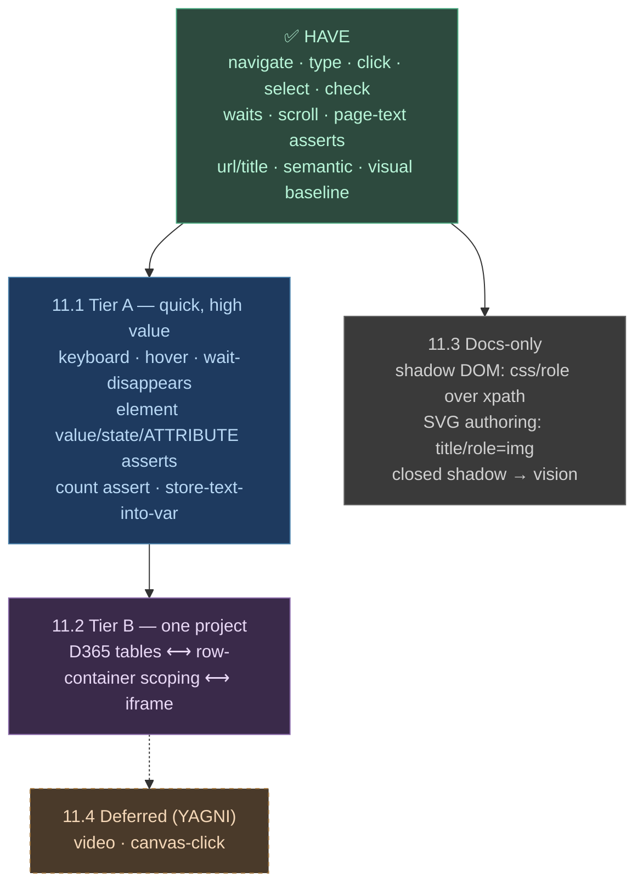

# Phase 11 — Step Coverage Expansion

**Goal**: Grow the resolver from a solid **happy-path** engine into a **full
interaction** engine — covering text extraction, element-scoped assertions,
keyboard, hover, D365-style tables, and the SVG / container / shadow-DOM cases
testers actually hit — without breaking the "sentences over syntax" contract.

> Status: **Implemented** (11.1–11.3). 11.4 deferred (YAGNI). Builds on the
> Phase 9 locator/POM work and the Phase 10 local-model setup. Tests in
> `tests/test_patterns_phase11.py`. One deliberate simplification: table
> cell/row-count assertions use accessibility roles with a text-fallback rather
> than aria-colindex grid parsing — see the `ponytail:` notes in `actions.py`.

---

## The actual problem (and the constraint that shapes every fix)

Today's resolver matches ~40 patterns and the orchestrator dispatches a **fixed
action set** (`runner.py`):

```
navigate, click, fill, clear, select, check, uncheck, set_page, scroll,
scroll_to, wait_load, wait_networkidle, wait_visible, wait_seconds,
assert_visible, assert_hidden, assert_url, assert_title,
assert_semantic, visual_baseline, screenshot
```

**The constraint**: a step can only do what an *action* exists for. So a gap is
never "just add a regex" — it's **regex + action**, and if the LLM should be
able to emit it too, also a third edit:

> **Three edits per new capability:**
> 1. `resolver/patterns.py` — the regex (the sentence).
> 2. `agents/web/actions.py` + `orchestrator/runner.py` — the action (the doing).
> 3. `resolver/step_resolver.py` — add the action name to the LLM prompt's
>    `Valid action types` list, or the LLM fallback can never produce it.
>
> 1st-person verbs (`I hover ...`) also need the verb in
> `patterns.py:_FIRST_TO_THIRD` so `normalize_subject` maps it to 3rd person.

This is why coverage is the bottleneck: the LLM can't rescue what the framework
can't express. On a text-only local model (Phase 10), an unsupported step just
**fails** — it isn't healed.

---

## Design principle check (unchanged from Phase 9)

Every addition must:
- Keep steps **plain sentences** — no XPath/selectors leaking into `.feature`.
- Keep **accessibility before LLM** — new locators try role/label/text first.
- Be **backward compatible** — existing patterns and POM files keep working.
- Make tricky scoping **opt-in**, paid for only when needed.

---

## Coverage map (what we have vs what we're adding)



---

## Phase 11.1 — Tier A: the everyday gaps

Small, independent, each ~one pattern + one action. Highest value per line.

| Capability | Example sentence | New action | Notes |
|------------|------------------|------------|-------|
| **Keyboard keys** | `User presses Enter` / `Tab` / `Escape` | `press_key` | distinct from `press X button` (a click). `page.keyboard.press`. |
| **Hover** | `User hovers over the "Account" menu` | `hover` | flyout menus, tooltips. `locator.hover()`. |
| **Wait disappears** | `User waits until "Loading" disappears` | `wait_hidden` | mirror of existing `wait_visible`. |
| **Element value assert** | `the "Email" field should contain "a@b.com"` | `assert_value` | element-scoped; today only page-wide `should see`. |
| **Element state assert** | `the "Submit" button should be disabled` (`enabled`/`checked`/`selected`) | `assert_state` | `is_enabled()` / `is_checked()`. |
| **Attribute assert (covers SVG)** | `the chart line should have attribute "stroke" equal to "green"` | `assert_attribute` | SVG is DOM → assertable. |
| **Count assert** | `User should see 3 "result" items` | `assert_count` | `locator.count()`. |
| **Store text → var** | `User stores the order number as [ORDER]` | `store_text` | writes into the same `[var]` namespace `substitute()` reads. Enables data carried across steps. |

**Files**: `patterns.py` (8 patterns), `actions.py` + `runner.py` (8 actions),
`step_resolver.py` (extend the LLM `Valid action types` list), `_FIRST_TO_THIRD`
(add `hover`, `store`). One `tests/test_patterns_tier_a.py` asserting each
sentence resolves to the right action dict (no browser needed).

**`store_text` note**: variable substitution currently reads from `os.environ` /
`.env`. `store_text` needs a writable run-scoped store (e.g.
`context._vars`) that `substitute()` checks before env. Small but it touches the
substitution path — call it out in review.

**Acceptance**: each sentence above resolves to its action via pure regex (LLM
off); `store_text` then `fill` round-trips a captured value within one scenario.

---

## Phase 11.2 — Tier B: tables, row-containers, iframes (D365)

These three are **one shape** — scoping an action to a sub-region of the page —
so build them together. This is the D365 grid story.

### Row / cell scoping (the core table need)

```gherkin
# row-scoped action — "in the row containing X, do Y"
When User clicks "Edit" in the row containing "Contoso"
Then the cell in row "Contoso" column "Status" should be "Active"
And the grid should have 5 rows
```

New actions: `click_in_row`, `assert_cell`, `assert_row_count`. Implemented by
finding the row (`get_by_role("row").filter(has_text=...)`) then scoping the
inner locator to it — accessibility-first, no XPath in the feature.

### Lightweight container scoping (generalises the above)

```gherkin
When User clicks the "Save" button in the "Payment" section
```

A `within <container>` modifier that scopes the **next** locator. This is the
Phase 9-rejected "containment" idea, **resurrected only in its bounded form**
(named region / row), not a general parser.

### iframe support (D365 hosts its grid in an iframe)

```gherkin
Given User switches to the "main" frame
```

New action `switch_frame` setting `context._frame`; `locator.find` resolves
against the active frame when set. Closed frames are out of reach (expected).

**Files**: `patterns.py` (row/cell/frame/within patterns), `actions.py`
(`click_in_row`, `assert_cell`, `assert_row_count`, `switch_frame`),
`locator.py` (honour `within` scope + active frame), `runner.py` + LLM vocab,
`tests/test_patterns_tables.py` + a small `test_table_scope.py`.

**Lean on existing work**: D365 is a URL-static SPA, so reuse the Phase 9.3
**page-pin** (`Given User is on the "..." page`) for POM scoping inside the grid.

**Acceptance**: against a sample grid, a row-scoped click hits the right row's
button (not `.first`); `assert_cell` reads the correct cell; switching frame
makes elements inside the iframe resolvable.

---

## Phase 11.3 — Docs-only: SVG, shadow DOM, containers

No code — guidance that prevents foot-guns. Add to
[pom-key-mapping.md](pom-key-mapping.md) and [writing-a-test.md](writing-a-test.md).

- **Shadow DOM**: Playwright's `css`/`role`/`text` engines **auto-pierce open
  shadow DOM** — prefer them. **`xpath` does NOT pierce** — avoid xpath POM
  selectors on web-component pages. **Closed** shadow DOM is unreachable by any
  selector → the **vision LLM fallback** is the only route (and a valid reason
  to set a vision model).
- **SVG authoring**: an SVG icon with `<title>` or `role="img"` + `aria-label`
  gets an accessible name and resolves by name — no POM entry needed. Without
  one, add a `css`/`testid` POM entry (same as any icon-only button).
- **Containers**: until 11.2 ships, scope ambiguous elements via **scoped POM
  page-blocks** (Phase 9.2), not by adding selectors to the sentence.

**Acceptance**: docs reviewed; a shadow-DOM example and an SVG-icon example
exist in `writing-a-test.md`.

---

## Phase 11.4 — Deferred (YAGNI): video & canvas

- **Video** (`play` / `pause` / `the video should be playing`): trivial to wire
  (`<video>.play()` / `.paused`) but **no current suite needs it**. Build on
  first real demand. `# ponytail: YAGNI until a test actually checks video.`
- **Canvas data-point clicks**: `<canvas>` has no DOM to target — only fragile
  coordinate clicks via the visual agent. **Asserting** what a canvas/SVG chart
  *shows* is already covered by `assert_semantic` (vision). Don't build canvas
  interaction speculatively. `# ponytail: vision already answers "what does the chart show".`

---

## Sequencing & rationale

| Phase | Delivers | Feature-file change | Action set | Status |
|-------|----------|---------------------|------------|--------|
| 11.1 Tier A | keyboard, hover, waits, element/attr/state/count asserts, store-text | new sentences, all opt-in | +8 actions | Plan |
| 11.2 Tier B | D365 tables, row/container scoping, iframe | new opt-in sentences | +4 actions | Plan |
| 11.3 Docs | shadow/SVG/container guidance | none | none | Plan |
| 11.4 Video/canvas | — | — | — | Deferred (YAGNI) |

**Do 11.1 first** — it's the broadest win for the least code, unblocks most
real suites, and every item is independent (ship them one at a time). 11.2 is a
single themed project; don't start it piecemeal. 11.3 can land anytime (no code).

**Remember the third edit**: whenever an action is added in 11.1/11.2, update the
LLM `Valid action types` list in `step_resolver.py` — otherwise the action works
for matched sentences but the LLM fallback can never produce it.

---

## Alternatives considered and rejected

- **General containment parser in Gherkin** (`...in the header that is inside
  the nav`): heavy, and Phase 9 already rejected it. 11.2 takes only the bounded
  **row / named-section** form. Rejected (full parser).
- **Canvas interaction via coordinate clicks as a first-class step**: fragile
  under any layout change; vision/semantic covers the assertion need. Rejected.
- **XPath-based table/shadow selectors to "just make it work"**: xpath doesn't
  pierce shadow DOM and bakes brittle paths into POM. Prefer role/css scoping.
  Rejected as the mechanism (allowed only as a last-resort POM selector).
