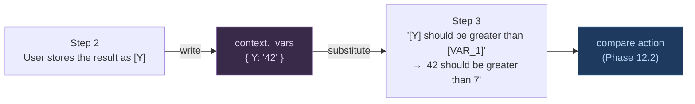

# Phase 12 — Step Dependencies & Shared State

**Goal**: Let a value produced in one step be used by a later step — the
"`store Y here, assert on Y there`" need — using plain Gherkin, with no DI
container and no expression engine.

> Status: **Plan**. Builds directly on Phase 11.1 (`store_text`,
> `context._vars`, `[VAR]` substitution), which already provides the
> write-and-read plumbing. Branch when picked up: `BFRAME_00XX`.

---

## The need (the user's example)

```gherkin
Given a user uses a calculator
And var 1 + var 2 = Y
Assert Y is greater than var 1
```

A value (`Y`) created mid-scenario must be reusable in a later step. In Selenium
+ Java you store it in a bean field and Spring injects it. We need the same
*effect* without classes to inject into.

---

## How this maps (and why most of it already exists)

| Selenium + Spring (Java) | BDDFrame |
|--------------------------|----------|
| Scenario-scoped bean holds the value | `context._vars` — per-scenario dict, reset in `before_scenario` |
| `@Autowired` into a step class | behave passes the shared `context` to every step — no wiring |
| Reference the object in **Java code** | Reference it in the **sentence** via `[VAR]` |
| Spring resolves the dependency | `substitute()` expands `[VAR]` → value **before** the step resolves |

`context` **is** the scenario-scoped bean; `[VAR]` substitution **is** the
injection. Phase 11.1 already ships:
- `store_text` → writes `context._vars[KEY]`.
- `substitute(text, context._vars)` → reads it back into any later sentence.

So the dependency *carrying* is done. Phase 12 adds only what's missing: a way to
**seed** values, **capture more kinds** of value, and **compare** them.



---

## Design principle check

- **Sentences over syntax** — references stay as `[VAR]` in the sentence; no
  code, no `${expr}` mini-language.
- **The framework tests the app, it does not replace it** — we do **not**
  compute `var1 + var2`. The app under test computes it; we store the app's
  output and assert on it. Anything else tests our own arithmetic, not the app.
- **Scenario-scoped by default** — vars reset between scenarios (already true).
  Cross-scenario state is an anti-pattern (tests must be independent) — out of
  scope.
- **Backward compatible** — `[VAR]` already means "substitute"; we only add
  steps and assertions.

---

## Phase 12.1 — Seed & capture values

Three small steps so a value can *enter* the store from anywhere, not just from
element text.

| Capability | Example sentence | Action |
|------------|------------------|--------|
| Seed a literal (expected value) | `User sets [TAX_RATE] to "0.13"` | `set_var` |
| Capture element text/value (exists) | `User stores the result as [Y]` | `store_text` ✅ 11.1 |
| Capture an element **attribute** | `User stores attribute "data-id" of the row as [ID]` | `store_attribute` |

`set_var` writes a literal straight into `context._vars`; `store_attribute`
reads `get_attribute` into it. Both reuse the 11.1 store — no new storage.

**Files**: `patterns.py` (2 patterns), `actions.py` (`store_attribute`),
`runner.py` (`set_var` writes `context._vars` inline, like `store_text`),
`step_resolver.py` (LLM vocab), `tests/test_patterns_phase12.py`.

**Acceptance**: `set_var` then a later `[VAR]` substitution round-trips the
literal; `store_attribute` captures a real attribute into a var.

---

## Phase 12.2 — Comparison assertions (the actual gap)

Assertions that compare two **already-substituted** values. Because
`substitute()` runs first, the comparison pattern only ever sees literals
(`"42 should be greater than 7"`) — so this is a pure compare, no var lookup
inside the action.

| Sentence (after `[VAR]` expansion) | Action | Compare |
|-----------------------------------|--------|---------|
| `"42" should be greater than "7"` | `assert_compare` | numeric `>` |
| `"7" should be less than "42"` | `assert_compare` | numeric `<` |
| `"42" should equal "42"` | `assert_compare` | `==` (numeric if both parse, else string) |
| `"abc" should contain "b"` | `assert_compare` | substring |
| `"42" should not equal "7"` | `assert_compare` | `!=` |

One `assert_compare(left, op, right)` action: try float-parse both for
`>`/`<`/`==`; fall back to string compare for `equal`/`contain`. Clear failure
message showing both sides.

**Files**: `patterns.py` (comparison patterns — place **before** the semantic
catch-all), `actions.py` (`assert_compare`), `runner.py`, `step_resolver.py`,
tests.

**Acceptance** (the user's example, working):
```gherkin
When User enters "5" in the first number field
And  User enters "3" in the second number field
And  User clicks the equals button
And  User stores the result as [Y]
Then [Y] should be greater than "5"
And  [Y] should equal "8"
```

---

## Phase 12.3 — (Deferred / YAGNI) computed expected values

A constrained helper like `User stores the sum of [A] and [B] as [C]` for the
rare case where the *expected* value must be derived in the test.

**Deferred, and discouraged.** Computing the expected value with the same logic
as the app re-implements the app in the test and proves nothing. Prefer: drive
the app, store its output, assert. Build only if a real suite needs a derived
*expected* (e.g. a known constant tax calc), and even then keep it to
sum/diff/round — never a general expression evaluator.
`# ponytail: no expression engine. The app computes; the test observes.`

---

## Sequencing & rationale

| Phase | Delivers | New steps | Status |
|-------|----------|-----------|--------|
| (11.1) | store value, carry via `[VAR]` | `store_text` | ✅ done |
| 12.1 | seed literals, capture attribute | `set_var`, `store_attribute` | Plan |
| 12.2 | comparison assertions | `assert_compare` | Plan |
| 12.3 | computed expected values | (constrained) | Deferred (YAGNI) |

**Do 12.2 first if you only do one** — it's the missing piece; `store_text`
(11.1) + substitution already carry the dependency, so comparison is all that
stands between today and the user's example working. 12.1 is convenience.

---

## Alternatives considered and rejected

- **A Spring-style DI container / typed object graph**: nothing to inject into
  (one catch-all step), and `context` already *is* the scenario-scoped bean.
  Pure overhead. Rejected.
- **An expression mini-language in Gherkin** (`${A + B}`, `[Y > X]`): turns the
  feature file into code, breaks "sentences over syntax," and re-implements app
  logic in tests. Rejected — use the app to compute, the store to carry, a
  comparison step to assert.
- **Cross-scenario / global variables**: makes tests order-dependent and flaky.
  Vars stay scenario-scoped. Rejected.
